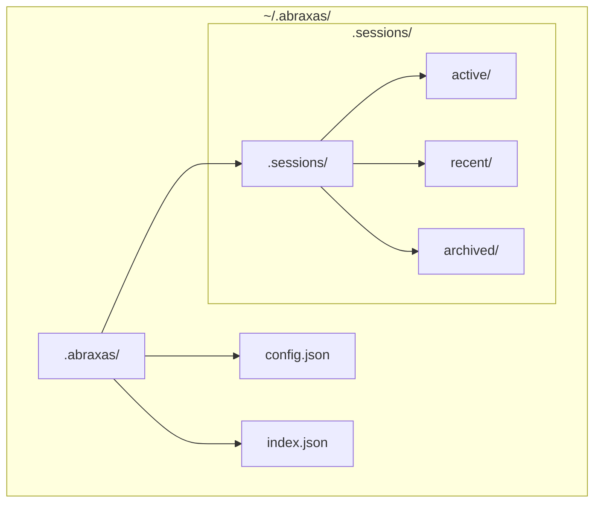
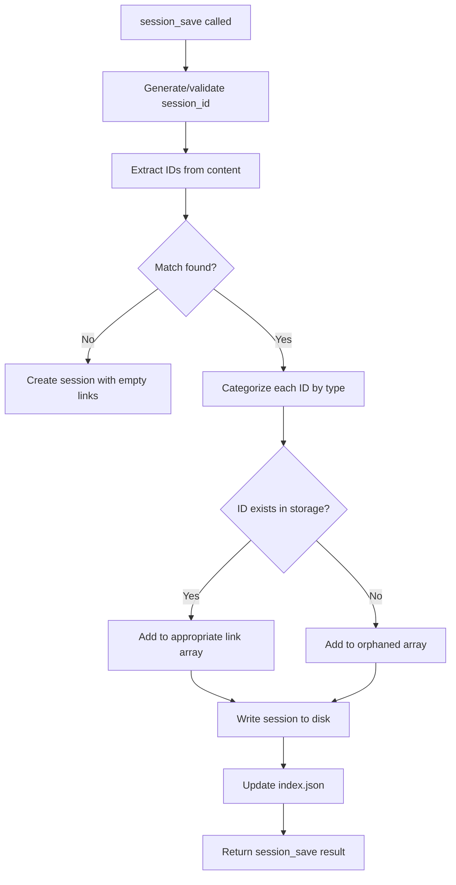
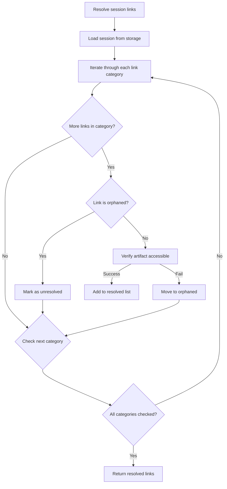
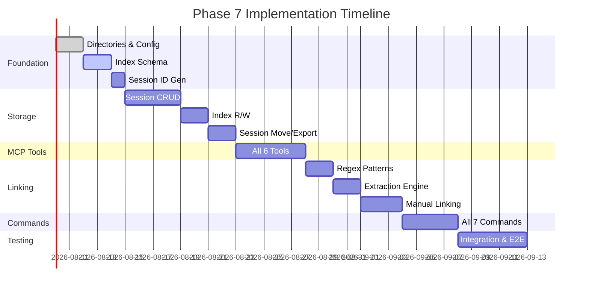

# Phase 7 — Session Continuity: Infrastructure Implementation Specification

This document provides concrete, implementable specifications for the Mnemosyne Session Continuity system. All specifications are detailed enough for direct implementation.

---

## 1. MCP Server Tool Specifications

All MCP tools operate within the `mnemosyne` namespace. Storage path: `~/.abraxas/.sessions/`

### 1.1 `session_save`

Saves a new session or updates an existing one.

**Input Parameters:**
```typescript
interface SessionSaveParams {
  session_id?: string;        // Optional: UUID. If omitted, generates new ID
  title: string;              // Required: Human-readable title
  content: string;            // Required: Session content
  metadata?: {
    tags?: string[];          // Optional: Searchable tags
    status?: "active" | "recent" | "archived";  // Default: "active"
    created_by?: string;      // Optional: Creator identifier
    custom?: Record<string, unknown>;  // Optional: Custom fields
  };
}
```

**Output Schema:**
```typescript
interface SessionSaveResult {
  success: boolean;
  session_id: string;          // UUID format: "mnemo-YYYYMMDD-HHMMSS-XXXXXXXX"
  title: string;
  created: string;             // ISO 8601 timestamp
  modified: string;            // ISO 8601 timestamp
  status: "active";
  links: {
    janus: string[];           // Extracted JL-XXXXXXXX IDs
    mnemon: string[];          // Extracted MB-XXXXXXXX IDs
    logos: string[];           // Extracted LA-XXXXXXXX IDs
    kairos: string[];         // Extracted KD-XXXXXXXX IDs
    manual: string[];         // Manually added links
    orphaned: string[];       // Links to non-existent artifacts
  };
  word_count: number;
}
```

**Error Handling:**
| Error Code | Condition | Recovery Action |
|------------|-----------|-----------------|
| `E_INVALID_TITLE` | Title empty or > 200 chars | Return error, request valid title |
| `E_INVALID_CONTENT` | Content empty or > 10MB | Return error, content too large |
| `E_SESSION_NOT_FOUND` | session_id provided but doesn't exist | Create new session with provided ID |
| `E_STORAGE_FULL` | Disk full | Return error with space required |
| `E_PERMISSION_DENIED` | Cannot write to storage path | Return error, suggest fix |
| `E_INDEX_CORRUPTED` | index.json parse failure | Trigger recovery (A2.3) |

---

### 1.2 `session_load`

Retrieves a session by ID, searching across all storage tiers.

**Input Parameters:**
```typescript
interface SessionLoadParams {
  session_id: string;         // Required: UUID to retrieve
  include_metadata?: boolean; // Default: true
  include_links?: boolean;    // Default: true
}
```

**Output Schema:**
```typescript
interface SessionLoadResult {
  success: boolean;
  session: {
    session_id: string;
    title: string;
    content: string;
    created: string;
    modified: string;
    status: "active" | "recent" | "archived";
    metadata: {
      tags: string[];
      created_by?: string;
      custom?: Record<string, unknown>;
    };
    links: {
      janus: string[];
      mnemon: string[];
      logos: string[];
      kairos: string[];
      manual: string[];
      orphaned: string[];
    };
    word_count: number;
  } | null;
}
```

**Error Handling:**
| Error Code | Condition | Recovery Action |
|------------|-----------|-----------------|
| `E_SESSION_NOT_FOUND` | Session ID not in any tier | Return null session, suggest alternatives |
| `E_SESSION_CORRUPTED` | JSON parse failure | Trigger recovery, return error |
| `E_PERMISSION_DENIED` | Cannot read file | Return error |

---

### 1.3 `session_list`

Lists sessions with filtering and pagination.

**Input Parameters:**
```typescript
interface SessionListParams {
  status?: "active" | "recent" | "archived" | "all";  // Default: "all"
  date_range?: {
    start?: string;           // ISO 8601 date
    end?: string;             // ISO 8601 date
  };
  tags?: string[];            // Filter by tags (AND logic)
  search?: string;            // Search in title and content
  limit?: number;             // Default: 20, Max: 100
  offset?: number;            // Default: 0
  sort_by?: "created" | "modified" | "title";  // Default: "modified"
  sort_order?: "asc" | "desc"; // Default: "desc"
}
```

**Output Schema:**
```typescript
interface SessionListResult {
  success: boolean;
  sessions: Array<{
    session_id: string;
    title: string;
    created: string;
    modified: string;
    status: "active" | "recent" | "archived";
    tags: string[];
    link_count: number;
    word_count: number;
    preview: string;           // First 100 chars of content
  }>;
  pagination: {
    total: number;
    limit: number;
    offset: number;
    has_more: boolean;
  };
}
```

**Error Handling:**
| Error Code | Condition | Recovery Action |
|------------|-----------|-----------------|
| `E_INVALID_DATE_RANGE` | End date before start date | Return error with explanation |
| `E_INVALID_PAGINATION` | limit > 100 or offset < 0 | Clamp to valid range |
| `E_INDEX_CORRUPTED` | Cannot read index | Trigger recovery |

---

### 1.4 `session_archive`

Moves a session from active/recent to archived storage.

**Input Parameters:**
```typescript
interface SessionArchiveParams {
  session_id: string;         // Required: UUID to archive
  confirm?: boolean;           // Default: false — require explicit confirmation
}
```

**Output Schema:**
```typescript
interface SessionArchiveResult {
  success: boolean;
  session_id: string;
  previous_status: "active" | "recent" | "archived";
  new_status: "archived";
  archived_at: string;         // ISO 8601 timestamp
}
```

**Error Handling:**
| Error Code | Condition | Recovery Action |
|------------|-----------|-----------------|
| `E_SESSION_NOT_FOUND` | Session not found | Return error |
| `E_ALREADY_ARCHIVED` | Session already archived | Return success, no-op |
| `E_CONFIRMATION_REQUIRED` | confirm not set to true | Return error requesting confirmation |
| `E_MOVE_FAILED` | File move operation failed | Return error with details |

---

### 1.5 `session_export`

Exports a session in the requested format.

**Input Parameters:**
```typescript
interface SessionExportParams {
  session_id: string;          // Required: UUID to export
  format: "json" | "markdown" | "text";  // Required
  include_metadata?: boolean;  // Default: true (ignored for text)
  include_links?: boolean;    // Default: true (ignored for text)
  output_path?: string;       // Optional: file path. If omitted, returns content
}
```

**Output Schema:**
```typescript
interface SessionExportResult {
  success: boolean;
  session_id: string;
  format: "json" | "markdown" | "text";
  content: string;             // Exported content (or file path if output_path set)
  size_bytes: number;
}
```

**Format Specifications:**

**JSON Format:**
```json
{
  "session_id": "mnemo-20260310-143022-abc12345",
  "title": "Dream Session - 2026-03-10",
  "created": "2026-03-10T14:30:22.000Z",
  "modified": "2026-03-10T16:45:00.000Z",
  "status": "archived",
  "content": "Full session content...",
  "metadata": { "tags": ["dream", "shadow"] },
  "links": { "janus": ["JL-00000001"], "manual": [] },
  "word_count": 1234
}
```

**Markdown Format:**
```markdown
---
title: Dream Session - 2026-03-10
session_id: mnemo-20260310-143022-abc12345
created: 2026-03-10T14:30:22.000Z
status: archived
tags: [dream, shadow]
links:
  janus: JL-00000001
  manual: []
---

# Dream Session - 2026-03-10

Full session content...

---
*Exported from Mnemosyne on 2026-03-10T16:45:00.000Z*
```

**Text Format:**
```
DREAM SESSION - 2026-03-10
=========================
ID: mnemo-20260310-143022-abc12345
Created: 2026-03-10T14:30:22.000Z
Status: archived

CONTENT:
Full session content...
```

**Error Handling:**
| Error Code | Condition | Recovery Action |
|------------|-----------|-----------------|
| `E_SESSION_NOT_FOUND` | Session not found | Return error |
| `E_INVALID_FORMAT` | Format not in [json, markdown, text] | Return error |
| `E_WRITE_FAILED` | Cannot write to output_path | Return error with details |
| `E_EXPORT_TOO_LARGE` | Result > 50MB | Return error, suggest JSON export |

---

### 1.6 `index_update`

Performs atomic updates to the session index.

**Input Parameters:**
```typescript
interface IndexUpdateParams {
  operation: "add" | "update" | "remove";  // Required
  session_id: string;                     // Required
  data?: {
    title?: string;
    status?: "active" | "recent" | "archived";
    tags?: string[];
    links?: {
      janus?: string[];
      mnemon?: string[];
      logos?: string[];
      kairos?: string[];
      manual?: string[];
      orphaned?: string[];
    };
    metadata?: Record<string, unknown>;
  };
}
```

**Output Schema:**
```typescript
interface IndexUpdateResult {
  success: boolean;
  operation: "add" | "update" | "remove";
  session_id: string;
  updated_index: {
    version: string;
    last_updated: string;
    session_count: number;
  };
  previous_state?: {
    title?: string;
    status?: string;
    tags?: string[];
  };
}
```

**Error Handling:**
| Error Code | Condition | Recovery Action |
|------------|-----------|-----------------|
| `E_INVALID_OPERATION` | Invalid operation type | Return error |
| `E_SESSION_NOT_FOUND` | Session not found for update/remove | Return error |
| `E_INDEX_LOCKED` | Another process holds lock | Retry with exponential backoff (3 attempts) |
| `E_INDEX_CORRUPTED` | Cannot parse index after update | Trigger recovery |

---

## 2. Storage Layer Design

### 2.1 Directory Structure



**Directory Specification:**

| Path | Purpose | Permissions |
|------|---------|-------------|
| `~/.abraxas/` | Base directory | 0o700 (user-only) |
| `~/.abraxas/.sessions/` | All session storage | 0o700 |
| `~/.abraxas/.sessions/active/` | Currently active sessions | 0o700 |
| `~/.abraxas/.sessions/recent/` | Recently accessed (last 7 days) | 0o700 |
| `~/.abraxas/.sessions/archived/` | Long-term storage | 0o700 |
| `~/.abraxas/config.json` | System configuration | 0o600 |
| `~/.abraxas/index.json` | Session index | 0o600 |

### 2.2 File Naming Conventions

**Session Files:**
- Format: `{session_id}.json`
- Example: `mnemo-20260310-143022-abc12345.json`

**Session ID Generation:**
```
mnemo-YYYYMMDD-HHMMSS-XXXXXXXX

Where:
  mnemo      = Fixed prefix
  YYYYMMDD   = Creation date (UTC)
  HHMMSS     = Creation time (UTC)
  XXXXXXXX   = 8-char random hex suffix (collision check required)
```

### 2.3 index.json Schema (Full JSON Schema)

```json
{
  "$schema": "https://json-schema.org/draft/2020-12/schema",
  "$id": "https://abraxas.ai/schemas/mnemosyne/index/v1",
  "title": "Mnemosyne Session Index",
  "description": "Index of all Mnemosyne sessions for cross-session continuity",
  "type": "object",
  "required": ["version", "last_updated", "sessions"],
  "properties": {
    "version": {
      "type": "string",
      "pattern": "^\\d+\\.\\d+\\.\\d+$",
      "description": "Schema version (e.g., '1.0.0')",
      "examples": ["1.0.0"]
    },
    "last_updated": {
      "type": "string",
      "format": "date-time",
      "description": "ISO 8601 timestamp of last index modification"
    },
    "sessions": {
      "type": "array",
      "description": "Array of session metadata entries",
      "items": {
        "$ref": "#/$defs/SessionIndexEntry"
      },
      "default": []
    }
  },
  "$defs": {
    "SessionIndexEntry": {
      "type": "object",
      "required": ["id", "title", "created", "modified", "status"],
      "properties": {
        "id": {
          "type": "string",
          "pattern": "^mnemo-\\d{8}-\\d{6}-[a-f0-9]{8}$",
          "description": "Unique session identifier"
        },
        "title": {
          "type": "string",
          "minLength": 1,
          "maxLength": 200,
          "description": "Human-readable session title"
        },
        "created": {
          "type": "string",
          "format": "date-time",
          "description": "ISO 8601 creation timestamp"
        },
        "modified": {
          "type": "string",
          "format": "date-time",
          "description": "ISO 8601 last modification timestamp"
        },
        "status": {
          "type": "string",
          "enum": ["active", "recent", "archived"],
          "description": "Current session lifecycle status"
        },
        "tags": {
          "type": "array",
          "items": { "type": "string" },
          "default": [],
          "description": "Searchable tags"
        },
        "links": {
          "$ref": "#/$defs/SessionLinks",
          "description": "Cross-skill references extracted from content"
        },
        "metadata": {
          "type": "object",
          "default": {},
          "description": "Custom metadata fields"
        },
        "file_path": {
          "type": "string",
          "description": "Relative path to session file (e.g., 'active/mnemo-XXX.json')"
        },
        "word_count": {
          "type": "integer",
          "minimum": 0,
          "description": "Word count of session content"
        }
      }
    },
    "SessionLinks": {
      "type": "object",
      "properties": {
        "janus": {
          "type": "array",
          "items": {
            "type": "string",
            "pattern": "^JL-[A-Z0-9]{8}$"
          },
          "default": [],
          "description": "Janus ledger IDs (JL-XXXXXXXX)"
        },
        "mnemon": {
          "type": "array",
          "items": {
            "type": "string",
            "pattern": "^MB-[A-Z0-9]{8}$"
          },
          "default": [],
          "description": "Mnemon belief IDs (MB-XXXXXXXX)"
        },
        "logos": {
          "type": "array",
          "items": {
            "type": "string",
            "pattern": "^LA-[A-Z0-9]{8}$"
          },
          "default": [],
          "description": "Logos analysis IDs (LA-XXXXXXXX)"
        },
        "kairos": {
          "type": "array",
          "items": {
            "type": "string",
            "pattern": "^KD-[A-Z0-9]{8}$"
          },
          "default": [],
          "description": "Kairos decision IDs (KD-XXXXXXXX)"
        },
        "manual": {
          "type": "array",
          "items": { "type": "string" },
          "default": [],
          "description": "Manually added cross-references"
        },
        "orphaned": {
          "type": "array",
          "items": { "type": "string" },
          "default": [],
          "description": "Links to non-existent artifacts"
        }
      }
    }
  }
}
```

**Example index.json:**
```json
{
  "version": "1.0.0",
  "last_updated": "2026-03-10T16:45:00.000Z",
  "sessions": [
    {
      "id": "mnemo-20260310-143022-abc12345",
      "title": "Dream Session - Shadow Work",
      "created": "2026-03-10T14:30:22.000Z",
      "modified": "2026-03-10T16:45:00.000Z",
      "status": "active",
      "tags": ["dream", "shadow", "anima"],
      "links": {
        "janus": ["JL-00000001", "JL-00000002"],
        "mnemon": [],
        "logos": ["LA-00000001"],
        "kairos": [],
        "manual": ["custom-ref:figure-01"],
        "orphaned": ["JL-99999999"]
      },
      "metadata": {
        "created_by": "abraxas-oneironautics"
      },
      "file_path": "active/mnemo-20260310-143022-abc12345.json",
      "word_count": 1234
    },
    {
      "id": "mnemo-20260308-090000-def67890",
      "title": "Morning Integration",
      "created": "2026-03-08T09:00:00.000Z",
      "modified": "2026-03-08T10:30:00.000Z",
      "status": "archived",
      "tags": ["integration", "rubedo"],
      "links": {
        "janus": [],
        "mnemon": ["MB-00000001"],
        "logos": [],
        "kairos": [],
        "manual": [],
        "orphaned": []
      },
      "metadata": {},
      "file_path": "archived/mnemo-20260308-090000-def67890.json",
      "word_count": 567
    }
  ]
}
```

### 2.4 Atomic Write Patterns

All file operations must use atomic write patterns to prevent corruption.

**Pattern 1: Session File Write**
```python
# Pseudocode for atomic session write
def write_session(session_id: str, content: bytes) -> None:
    temp_path = f"{active_dir}/.tmp-{session_id}-{uuid4()}.tmp"
    final_path = f"{active_dir}/{session_id}.json"
    
    # Write to temp file first
    with open(temp_path, 'w') as f:
        f.write(content)
        f.flush()
        os.fsync(f.fileno())  # Ensure data on disk
    
    # Atomic rename
    os.rename(temp_path, final_path)
```

**Pattern 2: Index Write**
```python
# Pseudocode for atomic index update
def update_index(updates: dict) -> None:
    temp_path = f"{index_dir}/.index.tmp-{uuid4()}"
    lock_path = f"{index_dir}/.index.lock"
    final_path = f"{index_dir}/index.json"
    
    # Acquire lock (non-blocking, fail if held)
    lock_fd = os.open(lock_path, os.O_CREAT | os.O_EXCL | os.O_WRONLY)
    try:
        # Read current index
        current = json.load(open(final_path))
        
        # Apply updates
        updated = apply_updates(current, updates)
        updated['last_updated'] = datetime.utcnow().isoformat()
        
        # Write to temp file
        with os.fdopen(lock_fd, 'w') as f:
            json.dump(updated, f, indent=2)
            f.flush()
            os.fsync(f.fileno())
        
        # Atomic rename
        os.rename(temp_path, final_path)
    finally:
        # Release lock (only if not already renamed)
        try:
            os.close(lock_fd)
            os.unlink(lock_path)
        except:
            pass
```

**Pattern 3: Session Move (Archive)**
```python
# Pseudocode for atomic session move between tiers
def move_session(session_id: str, from_tier: str, to_tier: str) -> None:
    from_path = f"{sessions_dir}/{from_tier}/{session_id}.json"
    to_path = f"{sessions_dir}/{to_tier}/{session_id}.json"
    
    # Ensure destination directory exists
    os.makedirs(os.path.dirname(to_path), exist_ok=True)
    
    # Read, validate, write new location, then delete old
    with open(from_path, 'r') as f:
        session_data = json.load(f)
    
    with open(to_path, 'w') as f:
        json.dump(session_data, f, indent=2)
        f.flush()
        os.fsync(f.fileno())
    
    # Only delete after successful write
    os.unlink(from_path)
    
    # Update index (separate atomic operation)
    update_index({
        'operation': 'update',
        'session_id': session_id,
        'data': {'status': to_tier, 'file_path': f'{to_tier}/{session_id}.json'}
    })
```

---

## 3. Cross-Skill Linking Engine

### 3.1 Regex Patterns for ID Extraction

| Skill/ID Type | Pattern | Example Match |
|---------------|---------|----------------|
| Janus Ledger | `JL-[A-Z0-9]{8}` | `JL-00000001`, `JL-ABC12345` |
| Mnemon Belief | `MB-[A-Z0-9]{8}` | `MB-00000001`, `MB-XYZ98765` |
| Logos Analysis | `LA-[A-Z0-9]{8}` | `LA-00000001`, `LA-DEF45678` |
| Kairos Decision | `KD-[A-Z0-9]{8}` | `KD-00000001`, `KD-GHI78901` |

**Regex Definitions (JavaScript/PCRE):**
```javascript
// All patterns - case sensitive, exact format
const PATTERNS = {
  janus: /JL-[A-Z0-9]{8}/g,
  mnemon: /MB-[A-Z0-9]{8}/g,
  logos: /LA-[A-Z0-9]{8}/g,
  kairos: /KD-[A-Z0-9]{8}/g,
};

// Combined pattern for single-pass extraction
const COMBINED_PATTERN = /(JL-[A-Z0-9]{8}|MB-[A-Z0-9]{8}|LA-[A-Z0-9]{8}|KD-[A-Z0-9]{8})/g;
```

### 3.2 Extraction Workflow



**Extraction Algorithm (Pseudocode):**
```python
def extract_links(content: str) -> SessionLinks:
    links = {
        'janus': [],
        'mnemon': [],
        'logos': [],
        'kairos': [],
        'manual': [],
        'orphaned': []
    }
    
    # Single-pass extraction using combined pattern
    all_ids = re.findall(COMBINED_PATTERN, content)
    
    for id in set(all_ids):  # Deduplicate
        if id.startswith('JL-'):
            if artifact_exists('janus', id):
                links['janus'].append(id)
            else:
                links['orphaned'].append(id)
        elif id.startswith('MB-'):
            if artifact_exists('mnemon', id):
                links['mnemon'].append(id)
            else:
                links['orphaned'].append(id)
        elif id.startswith('LA-'):
            if artifact_exists('logos', id):
                links['logos'].append(id)
            else:
                links['orphaned'].append(id)
        elif id.startswith('KD-'):
            if artifact_exists('kairos', id):
                links['kairos'].append(id)
            else:
                links['orphaned'].append(id)
    
    return links

def artifact_exists(skill: str, artifact_id: str) -> bool:
    # Check if artifact exists in skill's storage
    # Paths: ~/.abraxas/.artifacts/{skill}/{artifact_id}.json
    path = f"~/.abraxas/.artifacts/{skill}/{artifact_id}.json"
    return os.path.exists(path)
```

### 3.3 Link Resolution Algorithm



**Link Resolution Pseudocode:**
```python
def resolve_links(session_id: str) -> ResolvedLinks:
    session = load_session(session_id)
    links = session['links']
    
    resolved = {
        'janus': [],
        'mnemon': [],
        'logos': [],
        'kairos': [],
        'manual': [],
        'orphaned': []
    }
    
    # Check each category
    for skill, id_list in links.items():
        if skill == 'manual':
            # Manual links - validate if they look like system IDs
            for ref in id_list:
                if is_system_id_format(ref):
                    skill_type = infer_skill_type(ref)
                    if artifact_exists(skill_type, ref):
                        resolved[skill].append({'ref': ref, 'status': 'valid'})
                    else:
                        resolved['orphaned'].append({'ref': ref, 'status': 'missing'})
                else:
                    # Free-form reference - keep as-is
                    resolved[skill].append({'ref': ref, 'status': 'unknown'})
        else:
            # System IDs - check existence
            for id in id_list:
                if artifact_exists(skill, id):
                    resolved[skill].append({'ref': id, 'status': 'valid'})
                else:
                    resolved['orphaned'].append({'ref': id, 'status': 'missing'})
    
    return resolved
```

### 3.4 Manual Link Addition

**Command:** `/mnemosyne link --session <id> --target <artifact-ref>`

**Validation Rules:**
1. Target must match one of: `JL-XXXXXXXX`, `MB-XXXXXXXX`, `LA-XXXXXXXX`, `KD-XXXXXXXX`, or custom format
2. If system ID format, verify artifact exists (warning if missing, still allow add)
3. If custom format, accept without validation
4. Duplicate links are not added (deduplication)

---

## 4. Implementation Order

### Phase 4.1: Foundation (Week 1)

**Order of implementation:**

| Step | Task IDs | Description | Rationale |
|------|----------|-------------|-----------|
| 1 | B1.1, B1.2 | Create base and session directories | All other tasks require storage paths |
| 2 | B1.3 | Create config.json | Configuration needed early |
| 3 | A2.1 | Define index.json schema | Index structure must precede index operations |
| 4 | B1.4 | Initialize index.json | Empty index for subsequent operations |
| 5 | B2.1 | Session ID generation | Required for any session write |

**Deliverable:** Storage directories and empty index ready

### Phase 4.2: Core Storage Operations (Week 2)

| Step | Task IDs | Description | Rationale |
|------|----------|-------------|-----------|
| 6 | B2.2 | Session write (atomic) | Foundation for save operation |
| 7 | B2.3 | Session read | Foundation for load operation |
| 8 | A2.2 | Index read/write | Required for save/load to work correctly |
| 9 | A2.3 | Index recovery | Safety net for corrupted index |
| 10 | B2.4 | Session move (archive) | Required for archive tool |

**Deliverable:** Basic CRUD operations functional

### Phase 4.3: MCP Tools (Week 3)

| Step | Task IDs | Description | Rationale |
|------|----------|-------------|-----------|
| 11 | A1.1 | session_save | Primary save interface |
| 12 | A1.2 | session_load | Primary load interface |
| 13 | A1.3 | session_list | Browse/filter sessions |
| 14 | A1.4 | session_archive | Archive workflow |
| 15 | A1.5 | session_export | Export in multiple formats |
| 16 | A1.6 | index_update | Direct index manipulation |

**Deliverable:** All 6 MCP tools operational

### Phase 4.4: Cross-Skill Linking (Week 4)

| Step | Task IDs | Description | Rationale |
|------|----------|-------------|-----------|
| 17 | C1.1-C1.4 | Implement ID regex patterns | Foundation for extraction |
| 18 | C1.5 | Implement extraction engine | Auto-link on save |
| 19 | C1.6 | Handle missing artifacts | Orphaned link handling |
| 20 | C2.1 | Add manual link to session | User-controlled linking |
| 21 | C2.2 | Validate link target | Ensure links are valid |
| 22 | C2.3 | List session links | View all links for a session |

**Deliverable:** Full cross-skill linking operational

### Phase 4.5: Command Integration (Week 5)

| Step | Task IDs | Description | Rationale |
|------|----------|-------------|-----------|
| 23 | D1 | /mnemosyne save | User-facing save |
| 24 | D2 | /mnemosyne restore | User-facing load |
| 25 | D3 | /mnemosyne list | User-facing list |
| 26 | D4 | /mnemosyne archive | User-facing archive |
| 27 | D5 | /mnemosyne export | User-facing export |
| 28 | D6 | /mnemosyne link | User-facing link management |
| 29 | D7 | /mnemosyne recent | Quick access to recent |

**Deliverable:** All 7 /mnemosyne commands working

### Phase 4.6: Integration & Testing (Week 6)

| Step | Task IDs | Description | Rationale |
|------|----------|-------------|-----------|
| 30 | E1 | End-to-End Integration Testing | Full workflow validation |
| 31 | E2 | Error Handling & Edge Cases | Robustness under failure |
| 32 | — | Performance testing | Verify with 1000+ sessions |
| 33 | — | Documentation | Update docs/skills.md |

**Deliverable:** Production-ready Mnemosyne system

### Dependency Graph Summary



---

## 5. Configuration Reference

### config.json Schema

```json
{
  "$schema": "https://json-schema.org/draft/2020-12/schema",
  "type": "object",
  "properties": {
    "storage_path": {
      "type": "string",
      "default": "~/.abraxas/.sessions",
      "description": "Root path for session storage"
    },
    "max_session_size_bytes": {
      "type": "integer",
      "default": 10485760,
      "description": "Maximum session content size (10MB)"
    },
    "auto_archive_days": {
      "type": "integer",
      "default": 30,
      "description": "Days before active session moves to recent"
    },
    "recent_tier_days": {
      "type": "integer",
      "default": 7,
      "description": "Days before recent session becomes eligible for archive"
    },
    "index_lock_timeout_ms": {
      "type": "integer",
      "default": 5000,
      "description": "Timeout for acquiring index lock"
    },
    "enable_auto_extraction": {
      "type": "boolean",
      "default": true,
      "description": "Auto-extract cross-skill IDs on save"
    },
    "enable_orphaned_tracking": {
      "type": "boolean",
      "default": true,
      "description": "Track links to missing artifacts"
    }
  }
}
```

---

## 6. Error Codes Reference

| Code | Category | Description | HTTP Status (if applicable) |
|------|----------|-------------|------------------------------|
| `E_INVALID_TITLE` | Validation | Title validation failed | 400 |
| `E_INVALID_CONTENT` | Validation | Content validation failed | 400 |
| `E_INVALID_DATE_RANGE` | Validation | Date range invalid | 400 |
| `E_INVALID_FORMAT` | Validation | Export format invalid | 400 |
| `E_INVALID_OPERATION` | Validation | Index operation invalid | 400 |
| `E_SESSION_NOT_FOUND` | Not Found | Session doesn't exist | 404 |
| `E_ALREADY_ARCHIVED` | Conflict | Session already archived | 409 |
| `E_INDEX_LOCKED` | Conflict | Index is locked by another process | 423 |
| `E_CONFIRMATION_REQUIRED` | Validation | Action requires confirmation | 400 |
| `E_SESSION_CORRUPTED` | Data Error | Session JSON is corrupt | 500 |
| `E_INDEX_CORRUPTED` | Data Error | Index JSON is corrupt | 500 |
| `E_STORAGE_FULL` | Resource | Disk full | 507 |
| `E_PERMISSION_DENIED` | Security | Cannot access storage | 403 |
| `E_MOVE_FAILED` | System | File move operation failed | 500 |
| `E_WRITE_FAILED` | System | File write operation failed | 500 |
| `E_EXPORT_TOO_LARGE` | Resource | Export result too large | 413 |

---

## Appendix: Quick Reference Card

### MCP Tools Quick Reference

| Tool | Required Params | Optional Params |
|------|-----------------|-----------------|
| `session_save` | title, content | session_id, metadata |
| `session_load` | session_id | include_metadata, include_links |
| `session_list` | — | status, date_range, tags, search, limit, offset, sort_by |
| `session_archive` | session_id | confirm |
| `session_export` | session_id, format | include_metadata, include_links, output_path |
| `index_update` | operation, session_id | data |

### Cross-Skill ID Formats

| System | Prefix | Example |
|--------|--------|---------|
| Janus Ledger | JL- | JL-00000001 |
| Mnemon Belief | MB- | MB-ABC12345 |
| Logos Analysis | LA- | LA-DEF67890 |
| Kairos Decision | KD- | KD-GHI54321 |

### Storage Tiers

| Tier | Path | Retention |
|------|------|-----------|
| active | `~/.abraxas/.sessions/active/` | Current session |
| recent | `~/.abraxas/.sessions/recent/` | Last 7 days |
| archived | `~/.abraxas/.sessions/archived/` | Indefinite |
