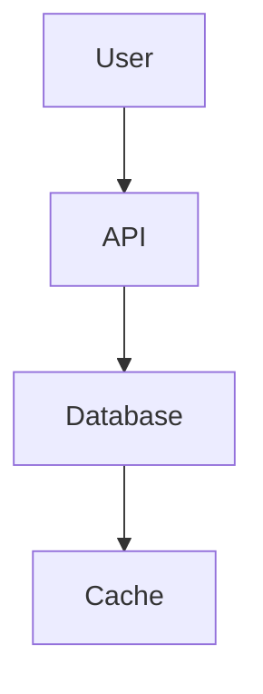

# The Great README Guide

**A comprehensive, research-backed guide to creating excellent project READMEs**

*Research sources: GitHub trending repos (10K+ stars), open source best practices, developer experience research, documentation standards*

---

## Table of Contents

1. [What to INCLUDE](#1-what-to-include)
2. [What to AVOID](#2-what-to-avoid)
3. [Structure Template](#3-structure-template)
4. [Examples from Top Repos](#4-examples-from-top-repos)
5. [Formatting Best Practices](#5-formatting-best-practices)
6. [SEO & Discoverability](#6--seo--discoverability)
7. [Maintenance Guidelines](#7-maintenance-guidelines)

---

## 1. What to INCLUDE

### Must-Haves (Non-Negotiable)

| Element | Purpose | Example |
|---------|---------|---------|
| **Project Name** | Clear, self-explaining title | `Visual Studio Code` not `Code-OSS` |
| **One-Line Description** | What it does, in plain language | "A JavaScript library for building user interfaces" |
| **Installation Instructions** | Get users running in <5 minutes | `pip install foobar` or `npm install react` |
| **Usage Examples** | Show, don't tell - minimal working example | Code snippet with expected output |
| **License** | Legal clarity, contribution terms | `MIT`, `Apache 2.0`, `GPL-3.0` |
| **Contributing Guidelines** | How to help (or link to CONTRIBUTING.md) | "Pull requests are welcome" |

### Nice-to-Haves (High Value)

| Element | When to Include | Impact |
|---------|-----------------|--------|
| **Badges** | Always for OSS projects | Instant credibility, status visibility |
| **Visuals** | UI projects, tools, libraries | 10x engagement vs text-only |
| **Features List** | Complex projects with multiple capabilities | Helps users self-qualify fit |
| **Prerequisites** | Non-trivial setup requirements | Prevents "doesn't work" issues |
| **Support Channels** | Active projects | Reduces issue noise, builds community |
| **Roadmap** | Actively developed projects | Manages expectations, shows direction |
| **Acknowledgments** | When standing on giants' shoulders | Good karma, attribution compliance |
| **Project Status** | Unmaintained or alpha projects | Manages expectations honestly |

### Contextual Additions

- **Background/Motivation** - For novel approaches or research projects
- **Alternatives/Comparison** - When differentiation matters
- **Architecture Diagram** - For complex systems (Linux kernel, databases)
- **Performance Benchmarks** - For performance-critical libraries
- **Security Policy** - For projects handling sensitive data
- **Code of Conduct** - For community-facing projects

---

## 2. What to AVOID

### Anti-Patterns (Common Mistakes)

| Anti-Pattern | Why It's Bad | Fix |
|--------------|--------------|-----|
| **"Awesome README"** | Generic, says nothing | "A Python library for dealing with word pluralization" |
| **No Installation** | Users bounce immediately | Add 1-liner install command |
| **Wall of Text** | Unscannable, intimidating | Use headers, lists, whitespace |
| **Outdated Examples** | Code doesn't run, trust lost | Test examples in CI |
| **Assumed Knowledge** | "Just read the source" | Link to prerequisites, explain terms |
| **No License** | Legal ambiguity scares contributors | Add LICENSE file, mention in README |
| **Broken Links** | 404s destroy credibility | Use link checkers, test regularly |
| **TODO: Everything** | Unfinished, unprofessional | Launch with complete docs |
| **Screenshot Only** | No text for search/SEO | Alt text + surrounding description |
| **Installation Hell** | 20 steps, unclear requirements | List prerequisites upfront |

### Tone Mistakes

- **Overly promotional** - "Revolutionary game-changing paradigm" → sounds like AI
- **Apologetic** - "Sorry this is messy" → undermines confidence
- **Vague attributions** - "Thanks to everyone" → name specific contributors
- **Rule of three** - "Fast, simple, and powerful" → cliché AI pattern
- **Em dash overuse** - Every sentence has—this—pattern → exhausting

### Technical Mistakes

- Hardcoded paths (`/home/tyler/project`)
- Platform-specific instructions without noting OS
- Version numbers that age poorly ("Requires Node 14")
- Screenshots with sensitive data visible
- No mobile-responsive formatting (tables overflow)

---

## 3. Structure Template

### Recommended Section Order

```markdown
# Project Name

[](link) [](link) [](link)

**One-sentence value proposition.** Extended description if needed—what problem does this solve, who is it for?

## Table of Contents

- [Installation](#installation)
- [Usage](#usage)
- [Features](#features)
- [Contributing](#contributing)
- [License](#license)

## Installation

### Prerequisites

- List required software/versions
- OS requirements
- Hardware requirements (if applicable)

### Quick Install

```bash
single-command-install
```

### Build from Source

```bash
git clone https://github.com/user/repo.git
cd repo
npm install  # or appropriate build command
```

## Usage

### Basic Example

```language
// Minimal working example
const result = library.function('input');
console.log(result); // expected output
```

### Advanced Usage

Link to full documentation for complex scenarios.

## Features

- **Feature 1:** Brief description
- **Feature 2:** Brief description
- **Feature 3:** Brief description

## Contributing

We welcome contributions! Please see [CONTRIBUTING.md](CONTRIBUTING.md) for:

- Development setup
- Coding standards
- Pull request process
- Code of Conduct

## Support

- **Issues:** [GitHub Issues](https://github.com/user/repo/issues)
- **Discussions:** [GitHub Discussions](https://github.com/user/repo/discussions)
- **Chat:** [Gitter/Slack/Discord link]

## License

This project is licensed under the [MIT License](LICENSE).

## Acknowledgments

- Original concept by [Name]
- Inspired by [Project]
- Thanks to [Contributors]
```

### Section-by-Section Breakdown

| Section | Ideal Length | Key Content |
|---------|--------------|-------------|
| **Header** | 2-4 lines | Name, badges, one-liner |
| **Description** | 1-3 paragraphs | Problem, solution, audience |
| **Installation** | 5-15 lines | Prereqs + commands |
| **Usage** | 10-30 lines | Examples with output |
| **Features** | 5-10 bullets | Capabilities, not marketing |
| **Contributing** | 5-10 lines | Link to detailed docs |
| **Support** | 3-5 lines | Where to get help |
| **License** | 1-2 lines | Type + link to file |

---

## 4. Examples from Top Repos

### React (100K+ stars)

**What Works:**
- Clean badge row with license, npm version, CI status
- Three bullet value prop: Declarative, Component-Based, Learn Once Write Anywhere
- Direct link to official docs (react.dev) not just GitHub
- Minimal installation section (gradual adoption emphasized)
- Working code example in 15 lines

**Structure:**
```
# React [badges]
React is a JavaScript library for building user interfaces.
• Declarative
• Component-Based  
• Learn Once, Write Anywhere
[Learn how to use React](link)

## Installation
Gradual adoption messaging + links to guides

## Documentation
Links to official docs sections

## Examples
Minimal working JSX example

## Contributing
Code of Conduct + Contributing Guide links
## License
MIT
```

**Takeaway:** React's README is a **gateway**, not the full docs. It sells the vision and points to deeper resources.

---

### VS Code (150K+ stars)

**What Works:**
- Clarifies OSS vs product distinction immediately
- Badges for feature requests, bugs, community chat
- Large hero image showing the product
- Clear contribution paths (issues, code review, docs)
- Links to wiki for roadmap, iteration plans
- Development container setup instructions
- Code of Conduct prominently displayed

**Structure:**
```
# Visual Studio Code - Open Source [badges]
## The Repository
Explains OSS relationship to commercial product

[Hero Image]

## Visual Studio Code
What it is, update cadence, download links

## Contributing
3 ways to participate + detailed How to Contribute link

## Feedback
Stack Overflow, feature requests, issues, chat

## Related Projects
Wiki link to ecosystem

## Bundled Extensions
Explains extension architecture

## Development Container
Dev environment setup

## Code of Conduct
## License
```

**Takeaway:** VS Code's README manages **expectations** about the OSS/product relationship and provides multiple contribution on-ramps.

---

### Linux Kernel (150K+ stars)

**What Works:**
- Role-based navigation ("Who Are You?")
- Essential docs linked upfront
- Quick Start for each persona
- Communication channels clearly listed
- AI coding assistant section (modern!)
- Documentation tree organized by audience

**Structure:**
```
# Linux kernel
Quick Start links

## Essential Documentation
Must-read docs for everyone

## Who Are You?
• New Kernel Developer → getting started links
• Academic Researcher → architecture docs
• Security Expert → security docs
• [8 more personas]

## Communication and Support
Mailing lists, IRC, bugzilla, MAINTAINERS
```

**Takeaway:** Linux's README **segments by audience**. A new contributor needs different links than a maintainer.

---

### Awesome Lists (100K+ stars)

**What Works:**
- Centered logo + sponsor section
- Table of contents with 20+ categories
- Consistent list format: `[Name](url) - description`
- Cross-linked related awesome lists
- Contribution guidelines linked
- Mobile-friendly formatting

**Takeaway:** Awesome READMEs are **curated directories**. Consistency and scannability matter most.

---

## 5. Formatting Best Practices

### Markdown Excellence

| Technique | Example | Why |
|-----------|---------|-----|
| **Headers** | `##`, `###` (not `####` deep) | Scannable hierarchy |
| **Code blocks** | \`\`\`python + syntax highlighting | Readable examples |
| **Bold emphasis** | **key terms** not _italics_ | Faster scanning |
| **Lists** | `-` or `*` consistently | Clean rendering |
| **Links** | `[text](url)` with descriptive text | Clear CTAs |
| **Tables** | For comparisons, not layouts | Mobile-friendly |
| **Blockquotes** | `> ` for notes, warnings | Visual separation |

### Badge Strategy

**Essential Badges:**
```markdown
[](LICENSE)
[](link)
[](link)
[](link)
```

**Badge Guidelines:**
- **Limit to 5-7 max** - More looks spammy
- **Consistent style** - All flat, same height
- **Link to relevant pages** - Badges should be clickable
- **Use shields.io** - Industry standard, 1000+ services
- **Dark mode compatible** - Test both themes

**Badge Categories:**
| Category | Examples |
|----------|----------|
| **Status** | Build, tests, coverage, code quality |
| **Version** | npm, PyPI, crates.io, Docker tags |
| **Community** | Downloads, contributors, issues, discussions |
| **License** | MIT, Apache, GPL, BSD |
| **Social** | Twitter, Discord, Gitter, Slack |

### Visual Best Practices

**Screenshots:**
- Max width 800px (use ``)
- Alt text for accessibility
- Show actual usage, not just UI
- Annotate with arrows/text if needed

**GIFs/Demos:**
- <5 seconds, <2MB
- Show workflow, not static state
- Use asciinema for terminal demos
- Consider Lottie for animations

**Diagrams:**
- Use Mermaid for flowcharts (GitHub native)
- Export SVG for complex architecture
- Include text description for SEO



### Mobile Considerations

- **Tables:** Use scrollable containers or convert to lists
- **Code:** Enable horizontal scroll, don't wrap
- **Images:** Set max-width: 100%
- **Headers:** Don't go deeper than H3
- **Badges:** Wrap on mobile, don't force horizontal

---

## 6. SEO & Discoverability

### GitHub Search Optimization

| Factor | Impact | Implementation |
|--------|--------|----------------|
| **Repo name** | High | Include keywords (not just clever name) |
| **First 200 words** | High | Front-load value prop with keywords |
| **Description field** | Medium | Fill GitHub repo description |
| **Topics** | Medium | Add 5 relevant topics in repo settings |
| **Links in** | High | Get mentioned in other READMEs, awesome lists |
| **Activity** | Medium | Regular commits, issues, releases |

### Google Indexing

- **README.md renders as HTML** - Google indexes GitHub pages
- **Use semantic headers** - H1, H2, H3 hierarchy
- **Descriptive link text** - "React documentation" not "click here"
- **Alt text on images** - `alt="React component example"`
- **Unique content** - Don't copy-paste from other projects

### Discoverability Tactics

1. **Submit to awesome lists** - `awesome-{domain}` curated lists
2. **Get featured** - GitHub trending, newsletters, blogs
3. **Cross-link** - Mention in related project READMEs
4. **Keywords naturally** - "Python web framework" in description
5. **Backlinks** - Blog posts, tutorials, conference talks

### Topics Strategy

GitHub topics act like tags. Use all 20 slots:

```
javascript, react, frontend, ui, components, 
spa, library, web, open-source, mit-license,
facebook, meta, ssr, hooks, context-api
```

**Best practices:**
- Mix broad + specific terms
- Include license type
- Add organization name
- Use common synonyms (JS + JavaScript)

---

## 7. Maintenance Guidelines

### Keeping README Fresh

| Trigger | Action | Frequency |
|---------|--------|-----------|
| **New release** | Update version badges, features | Per release |
| **Breaking change** | Update usage examples, prerequisites | As needed |
| **Docs restructure** | Update links, section order | Quarterly |
| **Community growth** | Add new support channels, contributors | Monthly |
| **Project pivot** | Rewrite description, features | As needed |
| **Link rot** | Run link checker, fix 404s | Monthly |

### Automated Maintenance

**GitHub Actions for README:**
```yaml
name: README Maintenance
on:
  schedule:
    - cron: '0 0 1 * *'  # Monthly
jobs:
  link-check:
    runs-on: ubuntu-latest
    steps:
      - uses: gaurav-nelson/github-action-markdown-link-check@v1
  badge-check:
    # Verify badges are loading
```

### Version Control for README

- **Pin version-specific docs** - Tag README for releases
- **Changelog sync** - Link to CHANGELOG.md for history
- **Deprecation notices** - Mark old sections, don't delete
- **Migration guides** - For breaking changes, link from README

### Community-Driven Updates

**Encourage contributions:**
- "Found a broken link? Open an issue"
- "Examples not working? Let us know"
- "Missing use case? Submit a PR"
- Use issue templates for docs feedback

### Warning Signs (README Needs Update)

| Signal | Meaning | Fix |
|--------|---------|-----|
| Issues: "Installation failed" | Prereqs outdated | Update requirements |
| Issues: "Example doesn't work" | Code rot | Test examples in CI |
| PRs: "Link 404" | Link decay | Run link checker |
| Stars flat, forks declining | Discovery issue | Improve SEO, submit to lists |
| "Is this maintained?" | Status unclear | Add project status badge |

### README as Code

Treat README like production code:
- **Code review** - PRs that touch README get reviewed
- **Testing** - Examples run in CI
- **Versioning** - README changes in changelog
- **Documentation** - Style guide for README writing

---

## Quick Checklist

### Pre-Launch Checklist

- [ ] Project name is clear and searchable
- [ ] One-line description explains value
- [ ] Installation works copy-paste
- [ ] Usage example runs successfully
- [ ] License specified
- [ ] Contributing guidelines linked
- [ ] At least 3 badges added
- [ ] All links tested (no 404s)
- [ ] Mobile rendering checked
- [ ] No hardcoded paths or usernames

### Post-Launch Maintenance

- [ ] Monthly link checker run
- [ ] Examples tested on each release
- [ ] Badges reflect current status
- [ ] New features added to list
- [ ] Contributors acknowledged
- [ ] Support channels monitored
- [ ] SEO topics reviewed quarterly

---

## Resources

### Tools

- **shields.io** - Badge generation
- **github-markdown-link-check** - Link validation
- **mermaid.live** - Diagram editor
- **asciinema.org** - Terminal recording
- **readme.so** - README editor

### Inspiration

- **awesome.re** - Curated awesome lists
- **makeareadme.com** - README generator
- **github.com/trending** - See what's working
- **readme-driven-development.com** - Philosophy

### Further Reading

- "Readme Driven Development" - Tom Preston-Werner
- "Documentation is a Product" - Kelsey Hightower
- "The Best READMEs on GitHub" - GitHub Blog
- "Developer Experience Best Practices" - DXLabs

---

**Last Updated:** March 2026  
**Research Sources:** React, VS Code, Linux Kernel, Awesome, Make a README, GitHub Best Practices  
**License:** CC0 1.0 (Use freely for any project)
