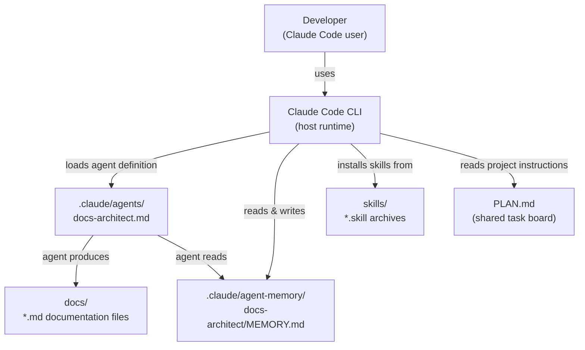
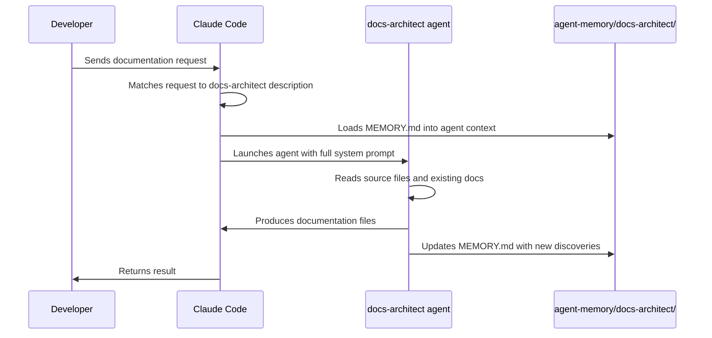
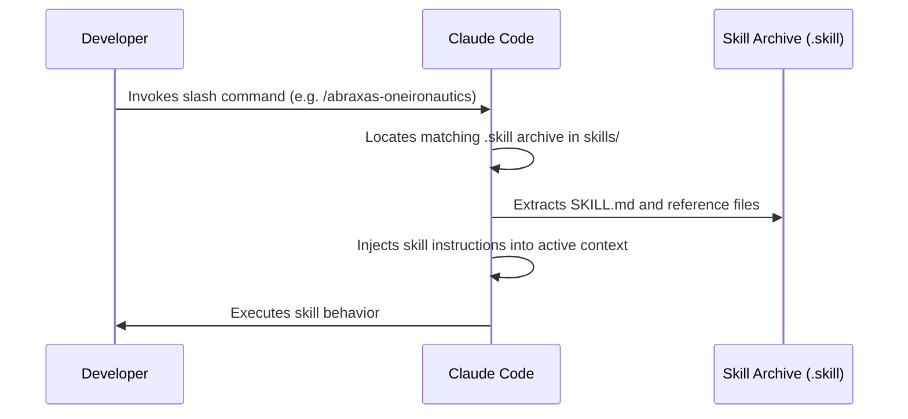
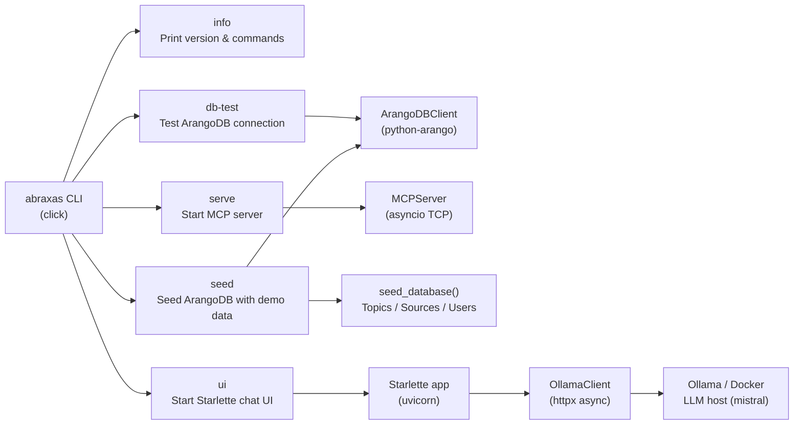
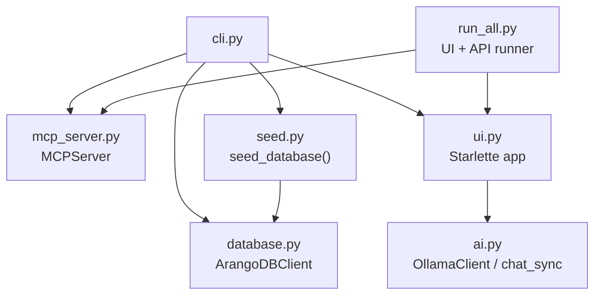
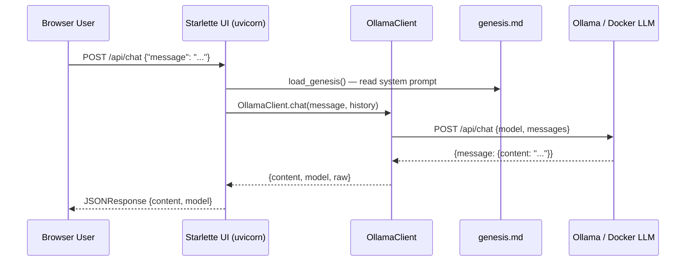
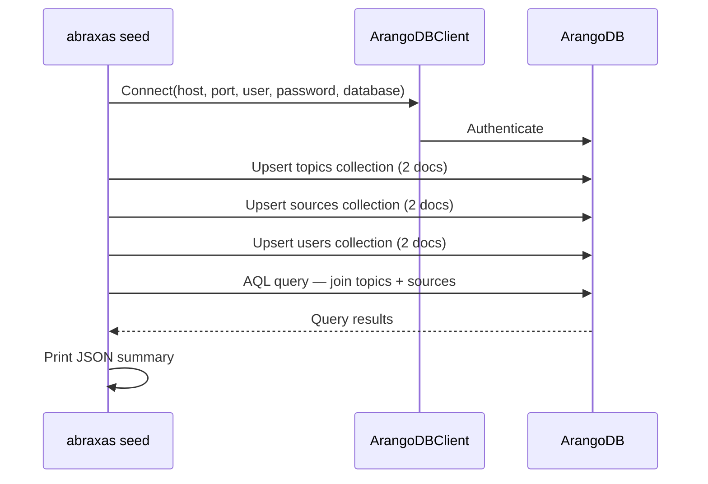

# Architecture

This document describes the system architecture of the Abraxas project — both its current skills-and-agents configuration and the historical Python CLI application that preceded it.

Intended audience: developers contributing to or integrating with Abraxas.

---

## Table of Contents

- [Current Architecture](#current-architecture)
  - [Overview](#overview)
  - [Component Diagram](#component-diagram)
  - [Agent Lifecycle](#agent-lifecycle)
  - [Skill Lifecycle](#skill-lifecycle)
- [Historical Architecture](#historical-architecture)
  - [Python CLI Overview](#python-cli-overview)
  - [Module Dependency Graph](#module-dependency-graph)
  - [Data Flow: Chat UI to Ollama](#data-flow-chat-ui-to-ollama)
  - [Data Flow: Database Seed](#data-flow-database-seed)

---

## Current Architecture

### Overview

Abraxas is now a Claude Code project. Its runtime host is the Claude Code CLI, which reads the project's `.claude/` directory to discover agents, skills, and persistent memory.

The project's deliverables are:

- **Skill archives** (`.skill` files in `skills/`) — installed by Claude Code to add slash commands.
- **Agent definitions** (`.md` files in `.claude/agents/`) — loaded by Claude Code as named subagents.
- **Agent memory** (`.claude/agent-memory/<agent-name>/`) — persisted across sessions so agents accumulate project knowledge.

### Component Diagram

_The Claude Code CLI is the runtime that orchestrates all components. Agents and skills are discovered from the `.claude/` and `skills/` directories respectively._

### Agent Lifecycle

_An agent is a stateful Claude instance. Its persistent memory is loaded at launch and updated at the end of each session, building institutional knowledge over time._

### Skill Lifecycle

_Skills extend Claude Code's slash-command vocabulary. They are zip archives unpacked at invocation time._

---

## Historical Architecture

> **Note:** The Python CLI application has been retired. This section is preserved for reference only. No Python source files exist in the current working tree.

### Python CLI Overview

The original Abraxas was a Python 3.9+ CLI built with Click. It exposed five commands that integrated ArangoDB, an MCP server, and an Ollama-hosted AI model.

_The CLI was the single entry point for all subsystems. Each command delegated to a dedicated module._

### Module Dependency Graph

_Each module had a single responsibility. `cli.py` wired them together; `run_all.py` launched the UI and MCP server concurrently._

### Data Flow: Chat UI to Ollama

_The system prompt (Abraxas constitution) was loaded from `genesis.md` on startup and prepended to every conversation._

### Data Flow: Database Seed

_The seed command was idempotent — it used `overwrite=True` on insert, so re-running it was safe._
