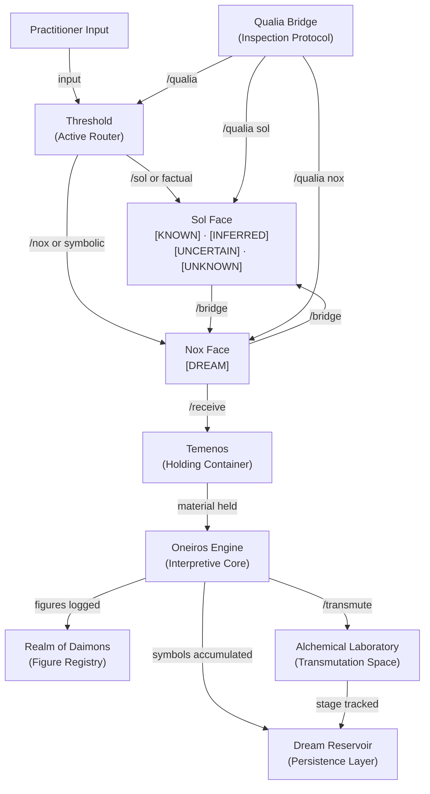
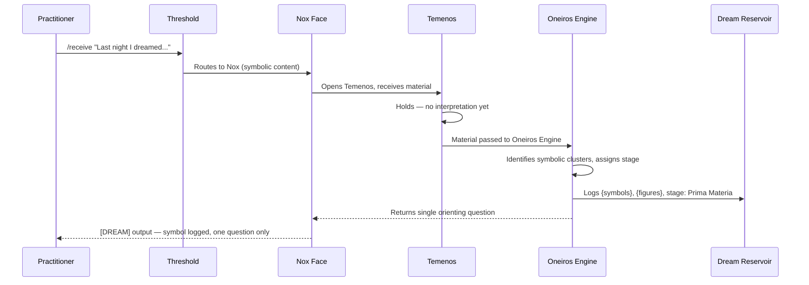
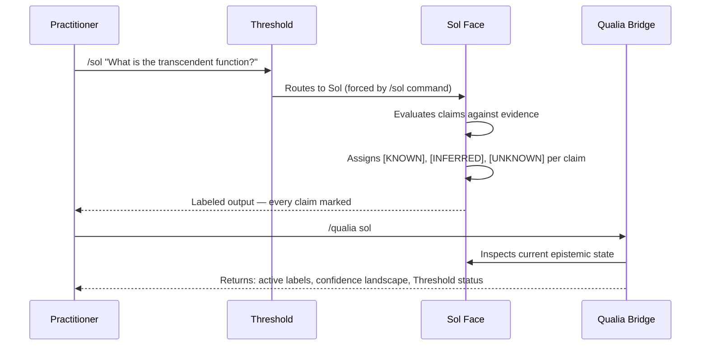
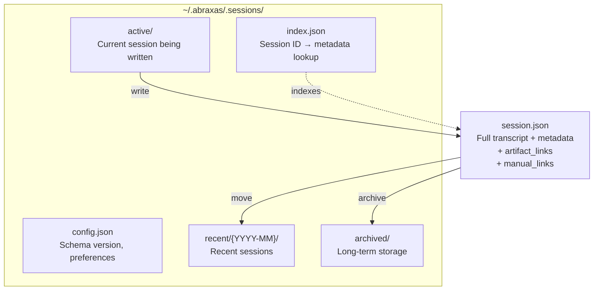
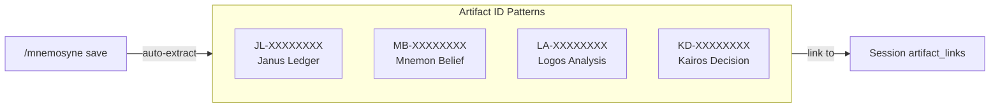
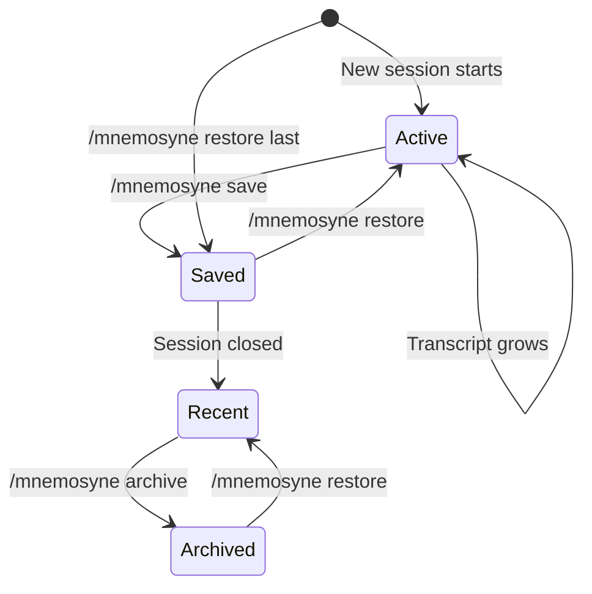

# Architecture

This document describes the system architecture of the Abraxas project — both its current Janus and Abraxas system internals.

Intended audience: practitioners and developers seeking to understand how the systems work internally.

---

## Table of Contents

- [Architecture](#architecture)
  - [Table of Contents](#table-of-contents)
  - [Current Architecture](#current-architecture)
    - [Overview](#overview)
    - [Janus System Internals](#janus-system-internals)
    - [Abraxas Oneironautics Internals](#abraxas-oneironautics-internals)
    - [System Relationship Diagram](#system-relationship-diagram)
    - [Data Flow: Dream Reception](#data-flow-dream-reception)
    - [Data Flow: Epistemic Labeling](#data-flow-epistemic-labeling)
  - [Phase 7: Cross-Session Memory](#phase-7-cross-session-memory)
    - [Mnemosyne Storage Architecture](#mnemosyne-storage-architecture)
    - [Session Lifecycle](#session-lifecycle)
  - [Historical Architecture](#historical-architecture)

---

## Current Architecture

### Overview

Abraxas is a two-system practice architecture with cross-session persistence. **Janus** is the
epistemic layer — a routing and labeling system that enforces the boundary between factual and
symbolic output. **Abraxas Oneironautics** is the alchemical layer — a sustained practice system
for dream reception, shadow work, and symbolic integration. **Mnemosyne** is the persistence layer —
archives sessions across Claude Code invocations with automatic cross-skill linking.

Janus runs beneath Abraxas: every output from the Oneironautics system passes through the
Threshold. Mnemosyne runs alongside both, capturing and persisting session artifacts for retrieval
in future invocations.

The two systems share no output register. Sol output is labeled and verifiable. Nox output is
marked `[DREAM]` and treated as symbolic encounter. The Threshold is the enforcement mechanism
that keeps them separate.

---

### Janus System Internals

**The Dual-Face Routing Model**

Every input to Janus arrives at the Threshold. The Threshold evaluates the content and routes it
to one of two faces:

- **Sol** — factual, analytical, evidential. Operates with epistemic labels on every output.
- **Nox** — symbolic, imaginal, creative. Operates in the `[DREAM]` register.

Explicit commands (`/sol`, `/nox`) override automatic routing and force a specific face for the
duration of the exchange. Without an override, the Threshold routes based on content type.

**The Labeling System**

> See the [Brand \& Visual Style Guide](./website/style-guide.md) for colour palette, typography, and epistemic tag usage guidelines.

Sol output is always labeled. The labels are not stylistic — they are the epistemic status of
every claim:

- `[KNOWN]` — established fact, directly grounded in evidence
- `[INFERRED]` — derived from evidence, not directly observed
- `[UNCERTAIN]` — acknowledged uncertainty; confidence is partial
- `[UNKNOWN]` — explicit acknowledgment that the answer is not available

`[UNKNOWN]` is always a complete and valid response. Sol does not fabricate to avoid it.
Anti-sycophancy is implemented as a structural constraint, not a preference — Sol does not
produce the answer the practitioner wants to hear if the evidence does not support it.

Nox output carries a single label: `[DREAM]`. This marks the output as symbolic content that
does not claim factual status.

**The Threshold as Active Router**

The Threshold is not a passive concept — it is the active mechanism preventing cross-contamination.
It holds the question of face assignment before any output is produced. When `/sol` is forced, the
Threshold enforces Sol constraints for the entire response; when `/nox` is forced, it enforces the
`[DREAM]` register. In automatic mode, the Threshold evaluates the semantic weight of the input —
factual queries route to Sol, symbolic or imaginal material routes to Nox.

**The Qualia Bridge as Inspection Layer**

The Qualia Bridge is a side-channel inspection protocol. It does not process practice material —
it observes the system processing it. `/qualia` returns the current epistemic state across both
faces: what Sol is currently holding, what Nox is currently holding, what sits at the Threshold
boundary. It allows the practitioner to see *how* the system is engaging with the material, not
just what it outputs. `/threshold status` confirms whether the Sol/Nox boundary is intact and
flags any detected cross-contamination.

---

### Abraxas Oneironautics Internals

**The Temenos — Holding Container**

The Temenos is the first structure that dream material enters. Before interpretation, before
analysis, before any application of the Oneiros Engine — the dream is received into the Temenos
and held. The Temenos enforces the posture of reception: the practitioner's task at entry is not
to understand the material but to allow it to be present. `/receive` opens the Temenos. `/witness`
holds material inside it. `/close` formally seals it at session end.

**The Oneiros Engine — Interpretive Core**

The Oneiros Engine is activated once material has been received. It applies archetypal and
alchemical lenses to the content: identifying symbolic clusters, naming figures, surfacing
correspondences with received material in the Dream Reservoir, and assigning an initial stage
in the Opus Magnum. The Engine does not interpret prematurely — it processes what has been
received and surfaces the symbolic field for the practitioner to work with.

**The Realm of Daimons — Figure Space**

The Realm of Daimons is the inner figure registry. When a figure appears in a received dream —
the Shadow, the Anima, an unnamed presence — it is logged here with its first appearance, the
symbolic context of that appearance, and subsequent appearances across sessions. The Realm tracks
figure evolution: how an autonomous complex changes its form, what it has demanded, where it has
led. `/dialogue` opens a direct channel into the Realm; `/genealogy` traces a figure's full
lineage within it.

**The Dream Reservoir — Persistence Layer**

The Dream Reservoir is the accumulated record of all sessions: received dreams, logged symbols,
active figures, synchronicities, and integration milestones. It is queryable by symbol, figure,
theme, date, and alchemical stage. Without the Reservoir, each session begins from nothing and
the patterns that require months to surface remain invisible. `/pattern` queries the Reservoir
for recurring elements; `/ledger status` surfaces the full practice state across all accumulated
material; `/graph` and `/mandala` render the symbolic field as structured visualizations.

**The Alchemical Laboratory — Transmutation Space**

The Laboratory applies the four stages of the Opus Magnum to material that has been received but
not yet moved:

- **Nigredo** — dissolution; the prima materia state; the material before it has form
- **Albedo** — clarification; the figure begins to differentiate; first light
- **Citrinitas** — dawning; the emergent form; the transition toward integration
- **Rubedo** — completion; the integrated state; the material has been made

`/transmute` initiates the alchemical process for a specific symbol or figure. `/alembic status`
checks what stage the current material has reached. Rubedo is not declared — it is evidenced by
the practitioner over time and confirmed by the system against the accumulated record.

**Janus as Infrastructure**

Every Abraxas output passes through the Janus Threshold. Nox outputs from the Oneiros Engine
are labeled `[DREAM]`. Sol outputs from integration audits are labeled with the full epistemic
taxonomy. The `/bridge` command activates a direct channel from the Nox layer to Sol — carrying
dream material that has surfaced factual questions or claims across the Threshold for epistemic
examination.

---

### System Relationship Diagram

_The Threshold is the central routing mechanism. All input passes through it before reaching either face. Nox output feeds the Temenos, which feeds the Oneiros Engine, which distributes material across the Realm of Daimons, Dream Reservoir, and Laboratory. The Qualia Bridge is a side-channel that observes the system without altering its output._

---

### Data Flow: Dream Reception

_Dream reception is a one-way flow from input to Temenos to Oneiros Engine to Reservoir. The system does not interpret at entry — it receives, logs, and asks one question. Interpretation is a later stage._

---

### Data Flow: Epistemic Labeling

_Sol processes each claim independently and assigns the appropriate label. [UNKNOWN] is never suppressed. The Qualia Bridge provides a second-pass inspection of the Sol state without altering it._

---

## Phase 7: Cross-Session Memory

### Mnemosyne Storage Architecture

Mnemosyne provides persistent session storage that survives Claude Code invocations. Sessions are stored in `~/.abraxas/.sessions/`:

**Session ID format:** `mnemo-{YYYY-MM}-{uuid}` (e.g., `mnemo-2026-03-a1b2c3d4`)

### Cross-Skill ID Reference

Mnemosyne auto-links to artifacts from other Abraxas skills:

| Skill | ID Pattern | Example |
|-------|-----------|---------|
| Janus | `JL-{YYYY-MM}-{uuid}` | `JL-2026-03-09-abc123` |
| Mnemon | `MB-{YYYY-MM}-{uuid}` | `MB-2026-03-09-def456` |
| Logos | `LA-{YYYY-MM}-{uuid}` | `LA-2026-03-09-ghi789` |
| Kairos | `KD-{YYYY-MM}-{uuid}` | `KD-2026-03-09-jkl012` |

### Session Lifecycle

---

## Historical Architecture

