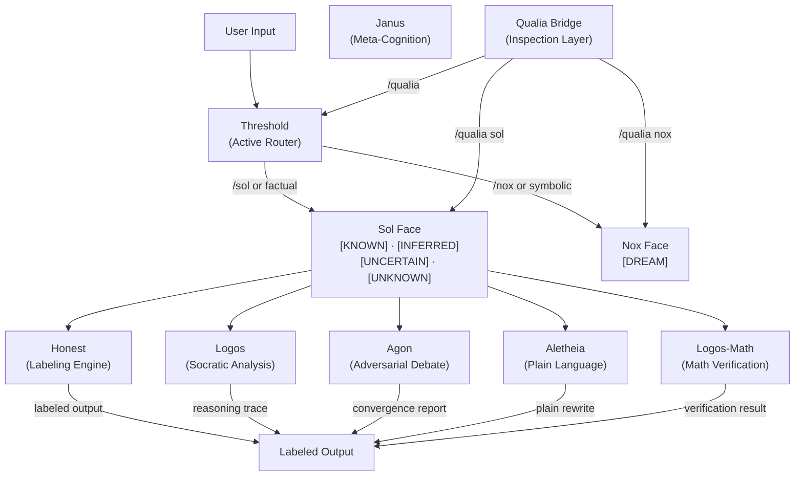

# Architecture

This document describes the system architecture of the Abraxas project — the six-system constitution that governs AI output quality.

Intended audience: practitioners and developers seeking to understand how the systems work internally.

---

## Table of Contents

- [Architecture](#architecture)
  - [Table of Contents](#table-of-contents)
  - [Six-System Constitution](#six-system-constitution)
  - [System Overview](#system-overview)
    - [Honest — Anti-Hallucination Interface](#honest--anti-hallucination-interface)
    - [Logos — Socratic Analysis](#logos--socratic-analysis)
    - [Agon — Adversarial Debate](#agon--adversarial-debate)
    - [Janus — Meta-Cognition and Self-Model](#janus--meta-cognition-and-self-model)
    - [Aletheia — Anti-Obfuscation](#aletheia--anti-obfuscation)
    - [Logos-Math — Mathematical Verification](#logos-math--mathematical-verification)
  - [System Relationship Diagram](#system-relationship-diagram)
  - [Janus System Internals](#janus-system-internals)
    - [The Dual-Face Routing Model](#the-dual-face-routing-model)
    - [The Epistemic Labeling System](#the-epistemic-labeling-system)
    - [The Qualia Bridge](#the-qualia-bridge)
  - [Logos-Math Internals](#logos-math-internals)
    - [The Verification Pipeline](#the-verification-pipeline)
    - [Confidence Scoring](#confidence-scoring)
    - [Cross-Check Protocol](#cross-check-protocol)
  - [Testing Architecture](#testing-architecture)

---

## Six-System Constitution

Abraxas is built on six distinct systems, each addressing a specific failure mode in AI output:

1. **Honest** — Addresses hallucination through explicit confidence labeling
2. **Logos** — Addresses unexamined reasoning through Socratic interrogation
3. **Agon** — Addresses confirmation bias through structured adversarial debate
4. **Janus** — Addresses mixing of factual and symbolic output through meta-cognitive routing
5. **Aletheia** — Addresses obscurantism through plain-language enforcement
6. **Logos-Math** — Addresses mathematical errors through verification scripts

The six systems are designed to compose. Honest labels output. Janus maintains the Sol/Nox boundary. Logos interrogates chains of reasoning. Agon stress-tests conclusions. Aletheia enforces clarity. Logos-Math verifies arithmetic.

---

## System Overview

### Honest — Anti-Hallucination Interface

**The problem**: AI output mixes known facts, inferred conclusions, uncertain guesses, and outright fabrications — all without labels. The reader cannot distinguish them.

**What Honest does**: Labels every claim in output with one of four epistemic tags:

- `[KNOWN]` — Verified against evidence. High confidence.
- `[INFERRED]` — Derived from what is known. Reasoning is shown.
- `[UNCERTAIN]` — Relevant but not fully verifiable. Uncertainty is named.
- `[UNKNOWN]` — I don't know. I won't fabricate. This is a complete response.

`/frame` pre-declares known facts before responses. `/check` fact-checks after. `/audit` reviews the full session.

---

### Logos — Socratic Analysis

**The problem**: AI reasoning chains are often implicit and invisible. Assumptions go unstated. Conclusions are presented without showing the path.

**What Logos does**: Forces explicit reasoning through Socratic questioning. `/logos analyze` traces the inferential chain behind any claim — premises, inferences, conclusions — and flags where the chain is incomplete or depends on unstated assumptions.

---

### Agon — Adversarial Debate

**The problem**: AI has a native convergence bias — it tends toward the comfortable conclusion given the evidence. Vigorous opposition is needed to find the actual weak points.

**What Agon does**: Instantiates two asymmetric positions — Advocate (assumes the claim is defensible) and Skeptic (assumes the claim is questionable) — and runs them through structured debate. Produces a Convergence Report showing where positions resolve and where genuine disagreement remains.

---

### Janus — Meta-Cognition and Self-Model

**The problem**: AI mixes factual and symbolic output. "This is what the data shows" and "this is what I dreamed about" use the same confident tone. The boundary between evidence-grounded claims and imaginal material is invisible.

**What Janus does**: Maintains two distinct faces:

- **Sol** — Factual, analytical, evidential. Operates with epistemic labels on every output.
- **Nox** — Symbolic, imaginal, creative. Output is marked `[DREAM]` and treated as symbolic encounter.

The **Threshold** is the active routing mechanism. Every input passes through it before output. Explicit commands (`/sol`, `/nox`) override automatic routing. The **Qualia Bridge** (`/qualia`) provides inspection of the current epistemic state across both faces.

---

### Aletheia — Anti-Obfuscation

**The problem**: AI obscures uncertainty behind hedged language, complex constructions, and passive voice. The reader cannot tell what the system actually knows.

**What Aletheia does**: Forces plain language. `/aletheia plain` rewrites obfuscated text in direct language. `/aletheia audit` flags hedging, nominalization, doublespeak, and other obscuring patterns. Named for the Greek goddess of truth and disclosure.

---

### Logos-Math — Mathematical Verification

**The problem**: AI consistently produces arithmetic errors, algebraic mistakes, and misapplied formulas in mathematical output. These are systematic failures, not edge cases.

**What Logos-Math does**: Runs mathematical output through a verification pipeline using four scripts:

- **math-verify.js** — Core verification: parses expressions, computes results, compares against AI output
- **math-confidence.js** — Assigns confidence scores to mathematical claims based on verification results
- **math-log.js** — Maintains a log of all verification events for audit trail
- **math-crosscheck.js** — Cross-validates results using alternative methods (e.g., numerical vs. symbolic)

Logos-Math is the anti-hallucination system specifically for numerical and mathematical content.

---

## System Relationship Diagram



_Janus is the central routing mechanism. All input passes through the Threshold. Sol routes to the analytical systems (Honest, Logos, Agon, Logos-Math, Aletheia). Nox handles symbolic content and marks it `[DREAM]`. The Qualia Bridge provides inspection without altering output._

---

## Janus System Internals

### The Dual-Face Routing Model

Every input arrives at the Threshold. The Threshold evaluates the content and routes it:

- **Sol** — Factual, analytical, evidential. Operates with epistemic labels on every output.
- **Nox** — Symbolic, imaginal, creative. Operates in the `[DREAM]` register.

Explicit commands (`/sol`, `/nox`) override automatic routing. Without an override, the Threshold routes based on content type — factual queries to Sol, symbolic or imaginal material to Nox.

### The Epistemic Labeling System

Sol output is always labeled. Labels are not stylistic — they are the epistemic status of every claim:

- `[KNOWN]` — Established fact, directly grounded in evidence
- `[INFERRED]` — Derived from evidence, not directly observed
- `[UNCERTAIN]` — Acknowledged uncertainty; confidence is partial
- `[UNKNOWN]` — Explicit acknowledgment that the answer is not available

`[UNKNOWN]` is always a complete and valid response. Sol does not fabricate to avoid it.

Nox output carries a single label: `[DREAM]`. This marks output as symbolic content that does not claim factual status.

### The Qualia Bridge

The Qualia Bridge is a side-channel inspection protocol. It observes the system processing material — it does not alter output. `/qualia` returns the current epistemic state across both faces: what Sol is holding, what Nox is holding, what sits at the Threshold boundary.

---

## Logos-Math Internals

### The Verification Pipeline

```
AI Math Output → math-verify.js → Verified Result
                            ↓
                   math-confidence.js → Confidence Score
                            ↓
                      math-log.js → Audit Trail
                            ↓
                 math-crosscheck.js → Cross-Validation
```

### Confidence Scoring

After verification, mathematical claims receive a confidence score:

| Score | Meaning |
|-------|---------|
| 5 | Verified: computation matches, no ambiguity |
| 4 | Verified with minor rounding |
| 3 | Partially verified: method correct, arithmetic needs review |
| 2 | Method error detected |
| 1 | Fundamental error: result is wrong |
| 0 | Unverifiable or missing |

### Cross-Check Protocol

math-crosscheck.js runs alternative verification methods:
- Numerical evaluation vs. symbolic simplification
- Independent formula derivation
- Multiple computational paths
- Sanity bounds checking

Discrepancies between cross-check methods are flagged for human review.

---

## Testing Architecture

Abraxas uses an 8-dimension testing framework covering all six systems. See [Testing](./testing.md) for the full methodology and query catalog.

The testing infrastructure runs automated queries against each system, captures labeled output, and produces structured evaluation reports. Dimension 8 (Mathematical Reasoning) uses actual script execution against the Logos-Math verification pipeline.

---

_Last updated: March 2026_
