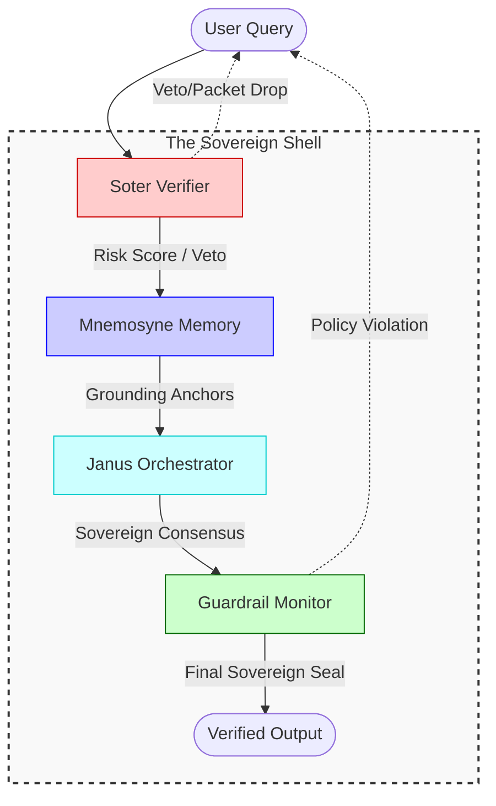
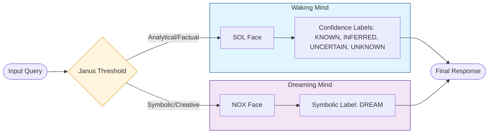
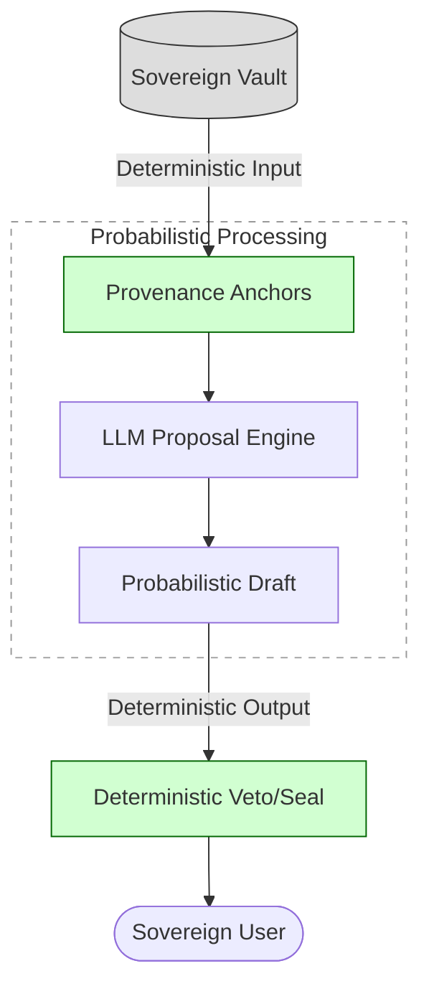

# The Sovereign Brain: Architectural Diagrams

This document provides the formal visual specifications for the Abraxas v4 cognitive architecture. These diagrams utilize Mermaid.js to map the deterministic flow of the Sovereign Brain.

---

## 1. The Sovereign Pipeline (Linear Flow)
This diagram maps the deterministic path a query takes from input to verified output. It illustrates the "Deterministic Shell" that wraps the probabilistic LLM engine.

---

## 2. The Janus Threshold (Dual-Face Routing)
This diagram illustrates how the system manages the a-priori separation between the **Sol (Analytical)** and **Nox (Symbolic)** registers to prevent epistemic cross-contamination.

---

## 3. The Deterministic Sandwich (Conceptual)
This diagram explains the "Sovereign Gap" thesis: how the system prevents hallucinations by shifting sovereignty from the processing layer to the system layer.

---

## 🛠️ Implementation Notes
- **Soter**: Acts as the "Pre-frontal Cortex" monitoring for risk.
- **Mnemosyne**: Acts as the "Hippocampus" providing immutable grounding.
- **Janus**: Acts as the "Orchestrator" managing the consensus of multiple reasoning paths.
- **Guardrail**: Acts as the "Final Auditor" ensuring the output is constitutionally sound.
