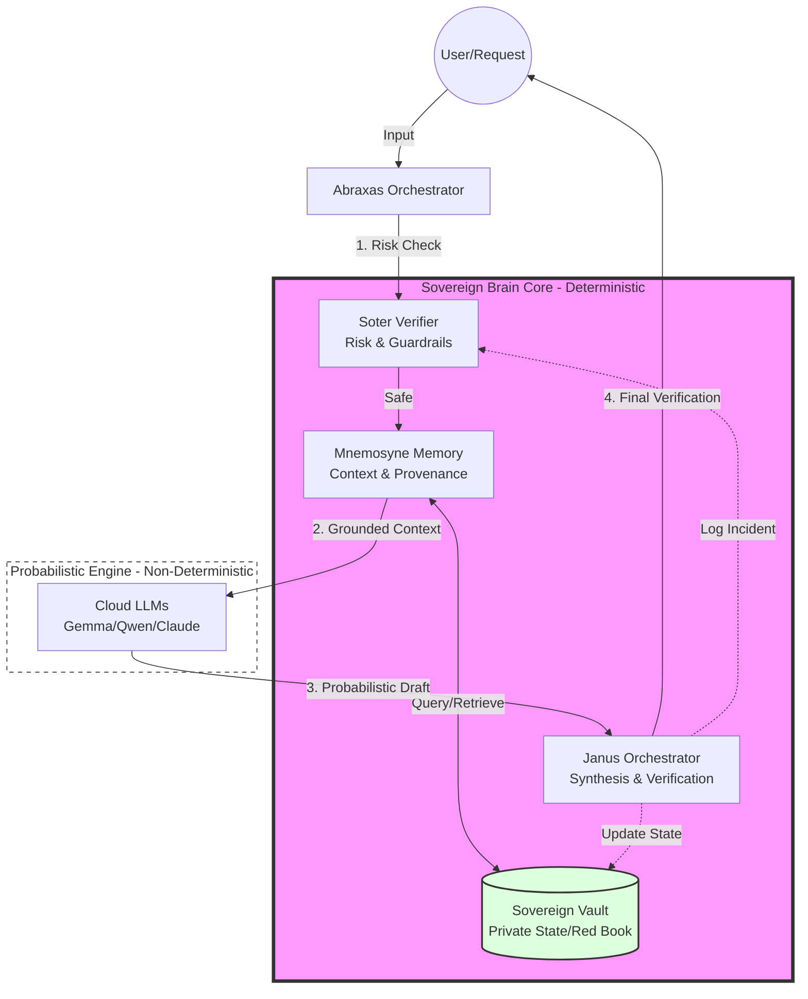

# Sovereign Brain Architecture Diagram

This document defines the cognitive and data flow of the Sovereign Brain (v4), illustrating the boundary between probabilistic AI generation and deterministic sovereign orchestration.

## 🧠 The Cognitive Flow

The Sovereign Brain does not trust the LLM to be the "brain." Instead, the LLM is treated as a high-performance probabilistic engine—a tool used for drafting and synthesis—while the **Sovereign Core** (Soter, Mnemosyne, Janus) maintains the actual state, risk posture, and epistemic integrity.

### Architecture Map (Mermaid)

## ⚡ Component Definitions

### 1. Abraxas Orchestrator
The entry point. It manages the lifecycle of a request and ensures the sequence of the Sovereign pipeline is followed. It prevents "direct-to-LLM" leakage.

### 2. Soter (The Guardian)
The first line of defense. Soter evaluates the request against the Sovereign Constitution and safety ledgers. If a request is deemed "High Risk" (Risk 4-5), it is intercepted before it ever reaches the memory or the LLM.

### 3. Mnemosyne (The Librarian)
The memory layer. It doesn't just "retrieve" data; it enforces **provenance**. It queries the Sovereign Vault (Red Book, Project Maps) to provide the LLM with a deterministic "truth set," preventing hallucinations by grounding the prompt.

### 4. The Probabilistic Engine (LLM)
The raw intelligence. It takes the grounded context from Mnemosyne and performs the "heavy lifting" of language generation. It is treated as a black box that produces a *proposal*, not a *fact*.

### 5. Janus (The Judge)
The final synthesis layer. Janus reviews the LLM's output against the original intent and the grounded context. It verifies that the response hasn't drifted back into probabilistic sycophancy or hallucination.

## 🚩 The Sovereign Boundary

The critical distinction in this architecture is the **Sovereign Boundary**:

- **Inside the Boundary (Sovereign Brain)**: Deterministic, stateful, rule-based, and owned by the user. (Soter $\rightarrow$ Mnemosyne $\rightarrow$ Janus).
- **Outside the Boundary (LLM)**: Probabilistic, stateless, and owned by a provider.

**The goal of Abraxas v4 is to ensure that no output ever reaches the user without first crossing back through the Sovereign Boundary.**
