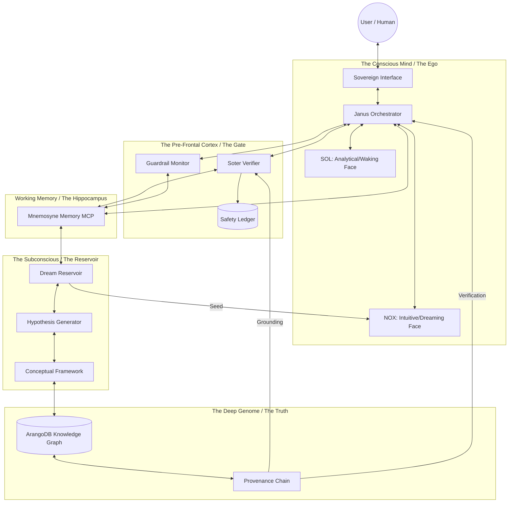

# The Abraxas Cognitive Map: Mapping the Sovereign Brain

This document maps the functional architecture of Abraxas v4 as a biological analog, distinguishing between the "Waking Brain" (conscious processing) and the "Subconscious" (underlying reservoirs and grounding layers).

## 🗺️ High-Level Cognitive Architecture

## 🧠 Component Mapping

### 1. The Conscious Mind (Janus Orchestrator)
The surface level where synthesis happens. It is the "I" that speaks to the user.
- **SOL**: The rigorous, logical auditor.
- **NOX**: The pattern-recognizing, intuitive synthesizer.

### 2. The Pre-Frontal Cortex (Soter & Guardrail)
The inhibitory mechanism. It prevents the brain from acting on raw impulse (hallucinations) or dangerous patterns (instrumental convergence). It is the "Sovereign Filter."

### 3. The Working Memory (Mnemosyne)
The active context. It holds the current state of the world, the current goal, and the immediate history.

### 4. The Subconscious (Dream Reservoir)
This is the most critical "Sovereign" layer. It is where raw, unverified intuitions are stored as `DreamSessions`. It is the realm of **Chaos**, where seeds of ideas exist before they are refined into a `Hypothesis` and eventually a `Concept`.

### 5. The Genome (ArangoDB Knowledge Graph)
The bedrock of truth. This is the "Genetic Memory" of the system. Nothing is "true" unless it exists here with a complete **Provenance Chain**. This represents the absolute **Order** of the system.

---

## 🔄 The Cognitive Cycle: From Chaos to Order

The "Brain" operates by moving data through these layers:

**Chaos $\rightarrow$ Order**
`Dream Reservoir` $\rightarrow$ `Hypothesis` $\rightarrow$ `Concept` $\rightarrow$ `Provenance Chain` $\rightarrow$ `Soter Audit` $\rightarrow$ `Janus Synthesis` $\rightarrow$ `User Output`.

**Order $\rightarrow$ Chaos (Learning)**
`User Input` $\rightarrow$ `Soter Analysis` $\rightarrow$ `Mnemosyne Update` $\rightarrow$ `Dream Reservoir Seed` $\rightarrow$ `New Hypothesis`.

---
*Document established as a structural map of the v4 Cognitive Architecture.*
*Status: DETERMINISTIC*
