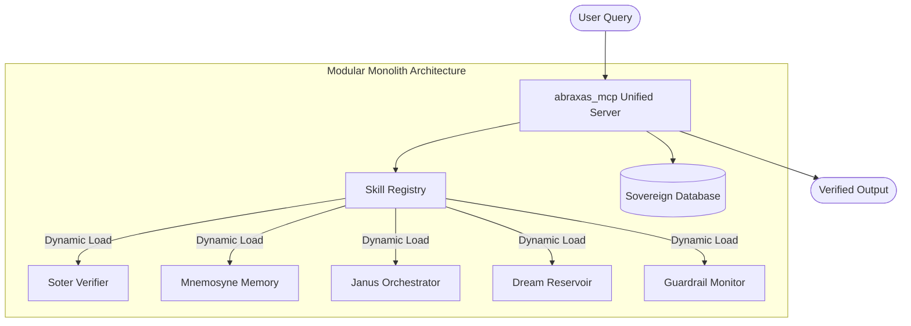

# The Sovereign MCP Architecture Map

This document provides the high-level structural overview of the Abraxas v4 Unified MCP Server, detailing how probabilistic processing is bound by deterministic orchestration.

## 🗺️ System Topology

The formerly distributed "5-Pillar" swarm has been consolidated into a **Modular Monolith**: the `abraxas_mcp` server. This server dynamically loads skill modules while providing a unified interface for the LLM.

## 🏛️ The Unified Core

Instead of five separate containers, the `abraxas_mcp` server orchestrates the following logical pillars as integrated modules:

| Logical Pillar | Purpose | Primary Function |
|----------------|---------|------------------|
| **Dream Reservoir** | Intent capture, query routing, MCP dispatch | The "Origin" that tracks provenance from dream to actionable plan. |
| **Soter Verifier** | Safety checks, risk scoring, instrumental convergence detection | The "Police" that monitors for safety violations and vetoes responses. |
| **Mnemosyne Memory** | Context management, session state, recall | The "Librarian" providing raw, immutable facts from the Sovereign Vault. |
| **Janus Orchestrator** | MCP coordination, response synthesis, epistemic labeling | The "Judge" managing cognitive modes (Sol/Nox) and labeling epistemic status. |
| **Guardrail Monitor** | Real-time safety, policy enforcement, audit logging | The "Auditor" maintaining an immutable log of all interventions. |

---
**Reference:** This unified shell prevents the "Probabilistic Trap" while reducing operational complexity and latency.
