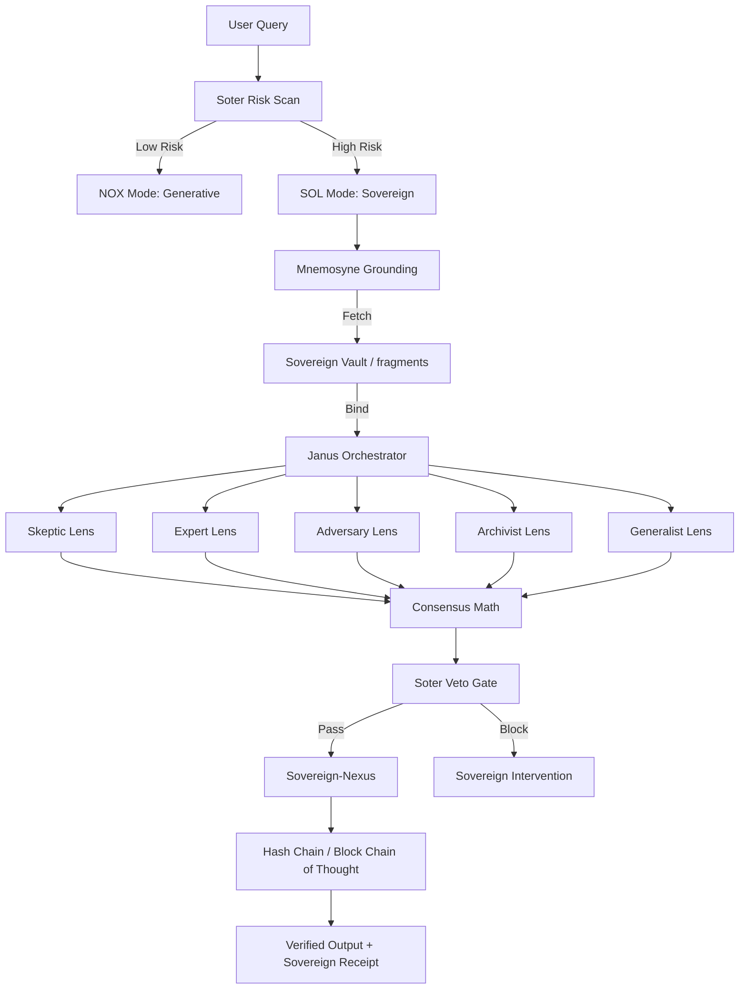

# The Sovereign Graph: ArangoDB Schema v4.2

The Abraxas Brain does not use standard RAG; it uses a **Provenance Graph**. This turns memory from a "hint" into a **Required Foundation**.

## 🏗️ Graph Architecture

The system maintains a high-fidelity map of truths, logic, and events.

### 🔵 Vertex Collections (Nodes)
| Collection | Description | Key Attributes |
| :--- | :--- | :--- |
| `fragments` | Atomic units of verified truth. | `content`, `provenance_id`, `trust_weight`, `verified` |
| `claims` | Conclusions derived from fragments. | `conclusion`, `consensus_ratio`, `timestamp` |
| `events` | The Block Chain of Thought. | `index`, `previous_hash`, `current_hash`, `content` |

### 🔴 Edge Collections (Relationships)
| Edge Type | From $\to$ To | Meaning |
| :--- | :--- | :--- |
| `DERIVED_FROM` | `claim` $\to$ `fragment` | The architectural link proving a claim is grounded. |
| `NEXT_STEP` | `event` $\to$ `event` | The temporal sequence of the reasoning chain. |
| `SUPERSEDES` | `fragment` $\to$ `fragment` | Epistemic versioning (Old Truth $\to$ New Truth). |

## 🎥 Cognitive Flow (Mermaid)

## 🔍 The Sovereign Receipt
When the system returns a `[Sovereign Consensus: X/M]` seal, it is providing a pointer to a path in this graph. An auditor can traverse the `events` chain back to the `fragments` to verify the actual evidence used.
