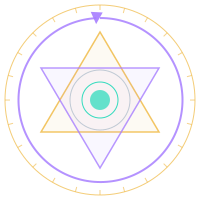

<div align="center">
  
</div>

# Abraxas Documentation

This is the documentation hub for the Abraxas project. Abraxas is the container for five
systems — **Honest**, the **Janus System**, **Agon**, **Aletheia**, and **Abraxas Oneironautics** — packaged as
Claude Code skills and supported by a suite of specialized subagents.

Use this index to navigate all available documentation.

---

## Getting Started

### Which System Should I Use?

| Your Goal | Start With |
|-----------|------------|
| Fact-check AI output, verify claims, force honest responses | **Honest** |
| Full epistemic session with Sol/Nox faces, Qualia Bridge | **Janus System** |
| Structured multi-perspective reasoning with opposing positions | **Agon** |
| Resolve labeled claims and track ground-truth calibration | **Aletheia** |
| Dream work, shadow integration, alchemical practice | **Abraxas Oneironautics** |
| Using a different LLM (ChatGPT, Claude.ai, Gemini) | **CONSTITUTION.md** |

### Which Approach Should I Choose?

**Using Claude Code?** → Install skills (Option 1)
- Full slash command access
- Session state auto-saved
- Recommended for Claude Code users

**Using another LLM?** → Load CONSTITUTION.md (Option 2)
- Works with Claude.ai, ChatGPT, Gemini, Ollama, LM Studio, and more
- Manual label typing required
- No installation needed

**Quick test?** → Try Honest first
- 9 plain-language commands
- No special vocabulary
- Solves most use cases

### Three Ways to Use Abraxas

| Approach | How | Best For |
|----------|-----|----------|
| **Skills** | Install `.skill` archives to Claude Code | Full functionality, auto state |
| **CONSTITUTION.md** | Load as system prompt in any LLM | Cross-platform, no install |
| **Manual** | Copy sections into prompts | Full control, more work |

See [Skills Reference](./skills.md) for detailed command documentation.

---

## Navigation

| Document | Description |
|---|---|
| [README](../README.md) | Project overview, Quick Start, structure, and getting started |
| [CONSTITUTION.md](../CONSTITUTION.md) | Universal LLM behavioral specification — for any LLM, no Claude Code required |
| [Architecture](./architecture.md) | System architecture diagrams and design decisions |
| [Skills Reference](./skills.md) | Full command reference for all five skills: Honest, Janus, Agon, Aletheia, and Abraxas Oneironautics |
| [Honest Integration Guide](./honest-integration.md) | How to use Honest alongside development tools, PR review, and coding sessions |
| [Composition Patterns](./composition-patterns.md) | Multi-skill session workflows: Honest+Janus, Agon+Aletheia, full-stack patterns |
| [Frames Reference](./frames.md) | Pre-built frame templates for contexts and evaluation criteria |
| [Visual Design](./visual-design.md) | Sacred geometry, alchemical aesthetics, and landing page design |

---

## Project Overview

Abraxas houses five systems, each addressing a distinct layer of the AI output problem:

**Honest** — The everyday anti-hallucination interface. Plain-language commands for
fact-checking, confidence labeling, claim tracing, and forcing maximum-honesty output.
Nine commands, including `/frame` for building and persisting session context. No special
vocabulary. The correct starting point for any user asking: *Is this true? How confident
are you? Where is this from? Show me what you're guessing.*

**Janus System** — An epistemic architecture with two labeled faces (Sol and Nox) and a
Threshold that prevents cross-contamination. Sol marks every output `[KNOWN]`, `[INFERRED]`,
`[UNCERTAIN]`, or `[UNKNOWN]`. Nox marks all symbolic/dream output `[DREAM]`. Anti-sycophancy
is built in. The Qualia Bridge provides inspection of the system's internal state. Janus is the
infrastructure layer — Honest runs on top of it, and Abraxas Oneironautics runs beneath it.

**Agon** — Structured adversarial reasoning. Two constrained positions (Advocate and Skeptic)
debate a claim with asymmetric position rules and a mandatory Convergence Report. Prevents the
collapse into single-perspective recommendations. Eight commands.

**Aletheia** — Epistemic calibration and ground-truth tracking. Resolves claims labeled by
Janus (or Honest), maintains a persistent resolution ledger, tracks disconfirmation rates, and
surfaces open epistemic debt. Seven commands. Stores resolutions in `~/.janus/` alongside Janus data.

**Abraxas Oneironautics** — The alchemical practice system built on top of Janus. Dream
reception, shadow work, symbolic integration, active imagination, the Nekyia descent. The
Oneiros Engine and the Realm of Daimons. The four stages of the Opus Magnum. The Janus
infrastructure runs beneath it all. Thirty-five commands.

All five systems are distributed as `.skill` archives (personal-scope Claude Code skills) and
are supported by eight specialized subagents defined in `.claude/agents/`. They are also
available as `CONSTITUTION.md` — a single portable document any capable LLM can load to
operate all five systems without Claude Code.

**Agents:**
- `skill-author` — Authors and packages `.skill` archives; owns the skill authoring workflow
- `project-coordinator` — Owns PLAN.md; coordinates cross-agent work; maintains meta-layer consistency
- `docs-architect` — Multi-level technical documentation with Mermaid diagrams
- `ai-rd-visionary` — AI model and agent architecture; hallucination and scheming risk assessment
- `brand-ux-architect` — Brand identity, naming conventions, aesthetic coherence; future UI design
- `systems-architect` — Project structure, skill format evolution, distribution mechanisms, tooling
- `constitution-keeper` — Maintains CONSTITUTION.md in sync with skill file changes
- `compatibility-keeper` — Maintains cross-platform compatibility between Claude Code and OpenCode

For the full command reference for all skills, see [Skills Reference](./skills.md).
For structural architecture, see [Architecture](./architecture.md).
For the visual design and sacred geometry philosophy, see [Visual Design](./visual-design.md).

---

## Visual Design & Sacred Geometry

The Abraxas landing page integrates sacred geometry patterns with the alchemical practice at its core. The design is not merely decorative — it is instructional and symbolic.

**Key Elements:**
- **Vesica Piscis** — The bridge between opposites (Sol and Nox)
- **Flower of Life** — Circles representing integration and wholeness
- **Opus Magnum Quadrants** — The four alchemical stages (Nigredo, Albedo, Citrinitas, Rubedo)
- **Sol/Nox Hexagrams** — Six-pointed stars at the Threshold marking epistemic duality
- **Central Mandala** — The Threshold itself as an active structure
- **Flowing Paths** — Animated connections showing material flowing through transformation

The geometry breathes and pulses, creating visual reinforcement of the system's core purpose: transforming fragmented, unlabeled, and unconscious AI behavior into integrated, truthful, and symbolically coherent output.

See [Visual Design](./visual-design.md) for detailed documentation of every geometric element, its meaning, and its alchemical correspondence.

---

## CONSTITUTION.md Setup

Load `CONSTITUTION.md` as your system prompt to use Abraxas with any LLM:

| Platform | How to Load |
|----------|-------------|
| Claude.ai | Settings → Advanced → Add to system prompt |
| ChatGPT | Settings → Instructions → Paste |
| Gemini | Settings → Advanced → System instructions |
| Ollama | `ollama run model -p system "$(cat CONSTITUTION.md)"` |
| LM Studio | System prompt field → Paste |
| Any other | Paste as first message or system prompt field |

### Using CONSTITUTION.md

When CONSTITUTION.md is active, prepend your query with:
```
[Activate Honest Mode]
[Your question here]
```

**Manual Labels** (type before your output):
- `[KNOWN]` — Established fact
- `[INFERRED]` — Derived from known information
- `[UNCERTAIN]` — Not fully confident
- `[UNKNOWN]` — I don't know, won't fabricate
- `[DREAM]` — Symbolic/creative material

---

## Project Status

As of March 2026, all five skills are operational. Honest provides 9 plain-language
anti-hallucination commands. The Janus System governs 14 commands including session tracking,
Qualia Bridge inspection, and the Bridge to Abraxas. Agon governs 8 commands for structured
adversarial reasoning with mandatory Convergence Reports. Aletheia governs 7 commands for
epistemic calibration and persistent resolution tracking. Abraxas Oneironautics governs 35
commands across dream reception, alchemical transmutation, active imagination, synchronicity,
and the Bridge to Janus.

Active work items are tracked in [PLAN.md](../PLAN.md).

---

## Document Map

```
abraxas/
├── README.md                # Start here — project overview and Quick Start
├── CONSTITUTION.md          # Universal LLM specification — load into any capable model
├── PLAN.md                  # Active roadmap
├── index.html               # Landing page with sacred geometry and alchemical design
├── frames/                  # Pre-built frame templates
│   ├── skeptic.md
│   ├── learner.md
│   ├── expert.md
│   └── ...
└── docs/
    ├── index.md             # This file — documentation hub
    ├── architecture.md      # Mermaid architecture diagrams
    ├── skills.md            # Full system reference: all commands for all five skills
    ├── honest-integration.md  # How to use Honest with dev tools and coding workflows
    ├── composition-patterns.md # Multi-skill session patterns and workflows
    ├── frames.md            # Frames reference: all 13 frame templates
    └── visual-design.md     # Visual design, sacred geometry, and aesthetic principles
```
