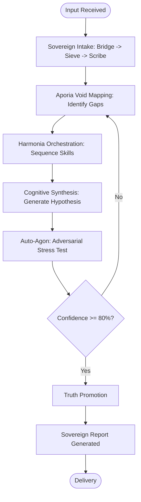
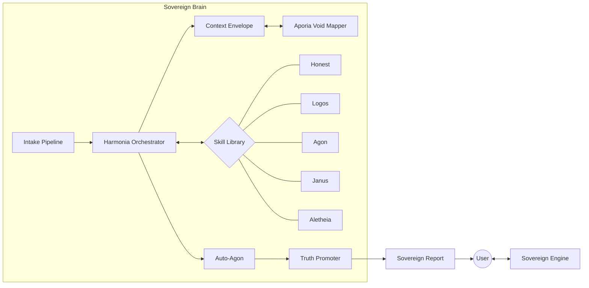

# Architecture
 
This document describes the system architecture of Abraxas v4.3 — the transition from a reactive toolkit to an **Autonomous Sovereign Agent**.
 
Intended audience: practitioners and developers seeking to understand the mechanics of Sovereign Mode.
 
---
 
## Table of Contents
 
- [Architecture](#architecture)
  - [Table of Contents](#table-of-contents)
  - [Sovereign Mode Evolution](#sovereign-mode-evolution)
  - [The Sovereign Stack](#the-sovereign-stack)
    - [The Sovereign Intake Pipeline](#the-sovereign-intake-pipeline)
    - [The Cognitive Engine](#the-cognitive-engine)
    - [The Verification Layer](#the-verification-layer)
  - [The Hunter Loop](#the-hunter-loop)
  - [Sovereign System Relationship Diagram](#sovereign-system-relationship-diagram)
  - [Component Internals](#component-internals)
    - [Harmonia & The Context Envelope](#harmonia--the-context-envelope)
    - [Aporia Void Mapping](#aporia-void-mapping)
    - [The Truth Promotion Threshold](#the-truth-promotion-threshold)
    - [Janus & The Qualia Bridge](#janus--the-qualia-bridge)
  - [Testing Architecture](#testing-architecture)
 
---
 
## Sovereign Mode Evolution
 
Abraxas has evolved through two distinct operational paradigms:
 
### Reactive Mode (v1.0 - v4.2)
In Reactive Mode, the system acted as a library of tools. The user was the orchestrator, deciding when to invoke `/honest` for a label or `/logos` for an analysis. The agent's role was to respond to explicit calls for epistemic discipline.
 
### Sovereign Mode (v4.3+)
In Sovereign Mode, the agent is **autonomous**. It no longer waits for a specific skill to be called; instead, it employs a continuous internal logic loop (The Hunter Loop) to process information. It proactively maps ignorance (Aporia), orchestrates the necessary skills (Harmonia), and stress-tests conclusions (Auto-Agon) before presenting a definitive **Sovereign Report**.
 
---
 
## The Sovereign Stack
 
### The Sovereign Intake Pipeline
Every piece of external information entering the system must pass through the Intake Gauntlet to ensure it is grounded and stored.
 
**Bridge $\rightarrow$ Sieve $\rightarrow$ Scribe Gauntlet**
 
1. **Bridge**: The entry point. Maps raw data to the Abraxas internal coordinate system.
2. **Sieve**: Filters noise and identifies the epistemic nature of the input (factual, symbolic, or heuristic).
3. **Scribe Gauntlet**: Commits the filtered data to the permanent ledger with full provenance, ensuring no information enters the Brain without a source.
 
### The Cognitive Engine
The central orchestration layer that manages the "state" of reasoning.
 
- **Harmonia Orchestrator**: The conductor. It composes multiple skills into a unified workflow. If a query requires both a Logos analysis and an Agon debate, Harmonia sequences these calls and manages the state handoff.
- **Context Envelope**: An immutable wrapper that travels with the reasoning chain. It prevents "context drift," ensuring that the premise established in step 1 is still the premise being tested in step 10.
- **Aporia Void Mapper**: The "Ignorance Engine." Before solving a problem, Aporia maps the **epistemic voids**—exactly what is *not* known and where the logic gaps reside. This transforms the goal from "answer the question" to "fill the void."
 
### The Verification Layer
The final quality gate before truth is promoted.
 
- **Auto-Agon**: A background process that automatically instantiates adversarial positions against any emerging hypothesis. It is the "immune system" of the Sovereign Brain.
- **Truth Promotion**: Abraxas does not "believe" in claims. It **promotes** them. A claim is promoted to [VERIFIED] status only when it survives Auto-Agon and meets a deterministic **80% confidence threshold** based on evidence and consistency.
 
---
 
## The Hunter Loop
 
Sovereign Mode operates via the **Hunter Loop**, a recursive process of refining truth:
 

 
---
 
## Sovereign System Relationship Diagram
 
The `abraxas_mcp` server now acts as the host for the Sovereign Brain.
 

 
---
 
## Component Internals
 
### Harmonia & The Context Envelope
Harmonia ensures that complex multi-step reasoning doesn't degrade. By using the **Context Envelope**, the system avoids the "forgetting" problem common in LLMs. The envelope stores the original intent, the current epistemic state, and the chain of evidence, forcing the model to remain anchored to the start of the loop.
 
### Aporia Void Mapping
Aporia uses "negative space" analysis. Instead of listing what it knows, it lists what is missing. This allows the Sovereign Agent to be honest about its limits and proactively search for the specific missing pieces of evidence required to hit the 80% threshold.
 
### The Truth Promotion Threshold
Confidence is not a feeling; it is a calculated score.
- **Evidence Strength** $\times$ **Consistency** $\times$ **Adversarial Resilience** $=$ **Confidence Score**.
- Claims below 80% are marked as `[UNCERTAIN]` or `[INFERRED]`.
- Claims $\ge 80\%$ are promoted to `[KNOWN]`.
 
### Janus & The Qualia Bridge
Janus remains the meta-cognitive router. In Sovereign Mode, Janus manages the transition between the **Sol** (analytical) and **Nox** (symbolic) registers. The **Qualia Bridge** allows the Orchestrator to inspect the "feel" of the evidence—determining if the system is experiencing "cognitive friction" (indicative of a hidden contradiction).
 
---
 
## Testing Architecture
 
Abraxas uses an 8-dimension testing framework. In Sovereign Mode, testing has shifted from "unit testing" individual skills to "integration testing" the Hunter Loop. We measure **Promotion Accuracy**: how often a promoted claim remains true under subsequent adversarial attacks.
 
---
 
_Last updated: May 2026_

