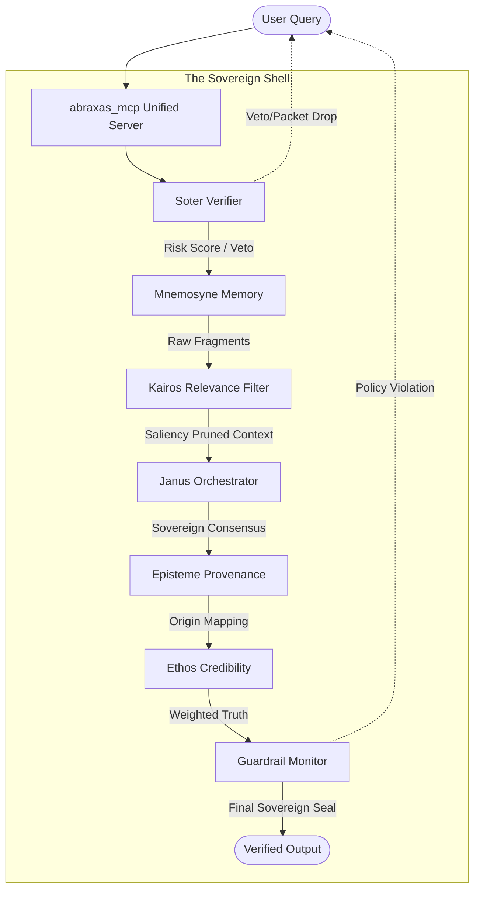
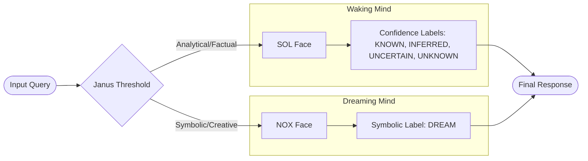
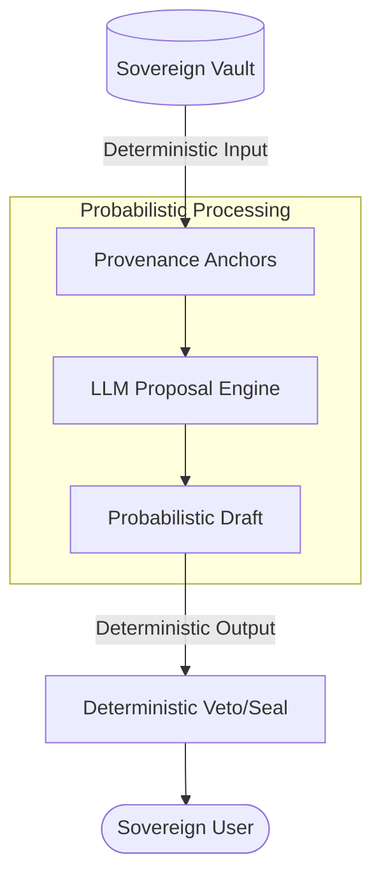

# The Sovereign Brain: Architectural Diagrams

**Domain:** Visual Specifications
**Source:** `docs/architecture/brain-diagram.md`
**Integrated:** 2026-05-14

---

## Overview

This document describes the formal visual specifications of the Abraxas v4 cognitive architecture. These prose descriptions correspond to Mermaid diagrams in the source `docs/architecture/brain-diagram.md`.

## 1. The Sovereign Pipeline (Expanded Flow)

The deterministic path a query takes from input to verified output:

At any point, Soter can veto (packet drop) and Guardrail can block on policy violation.

## 2. The Janus Threshold (Dual-Face Routing)

The a-priori separation between analytical and symbolic registers:

The SOL register (Waking Mind) handles factual claims with confidence labels. The NOX register (Dreaming Mind) handles creative content with the symbolic label. Labels never cross-contaminate between registers.

## 3. The Deterministic Sandwich (Conceptual)

The "Sovereign Gap" thesis visualized:

The probabilistic engine (LLM) is sandwiched between deterministic gates. It receives grounded input and its output is filtered before delivery. Sovereignty resides in the system layers, not the processing layer.

## Implementation Notes — Biological Analogs

| System | Biological Analog | Function |
|--------|------------------|----------|
| **Soter** | Pre-frontal Cortex | Risk monitoring, impulse inhibition |
| **Mnemosyne** | Hippocampus | Immutable grounding, memory retrieval |
| **Kairos** | Sieve / Attention Filter | Pruning context, preventing attention drift |
| **Janus** | Conscious Mind / Ego | Managing consensus of multiple reasoning paths |
| **Episteme** | Provenance Tracer | Mapping the origin of every claim |
| **Ethos** | Judge / Credibility Assessor | Weighting truth based on source credibility |
| **Guardrail** | Final Auditor | Ensuring constitutional soundness before output |

## Figure Descriptions (LaTeX-Compatible)

### Figure 1: The Abraxas v4 Sovereign Pipeline
A directed acyclic graph showing the flow from User Query through Soter, Mnemosyne, Kairos, Janus, Episteme, Ethos, and Guardrail to Verified Output. Soter and Guardrail have back-edges representing the veto/drop mechanism.

### Figure 2: The Janus Threshold
A decision tree showing the bifurcation of input into SOL (analytical/factual) and NOX (symbolic/creative) registers, each with their associated epistemic label sets, converging at Final Response.

### Figure 3: The Deterministic Sandwich
A three-layer architecture diagram with the Sovereign Vault feeding deterministic anchors into the probabilistic LLM engine, whose output is filtered through the deterministic veto/seal layer before reaching the Sovereign User.

---

*See also: [sovereign-graph.md](sovereign-graph.md), [cognitive-map.md](cognitive-map.md), [sovereign-brain-reference.md](../sovereign-brain-reference.md)*
