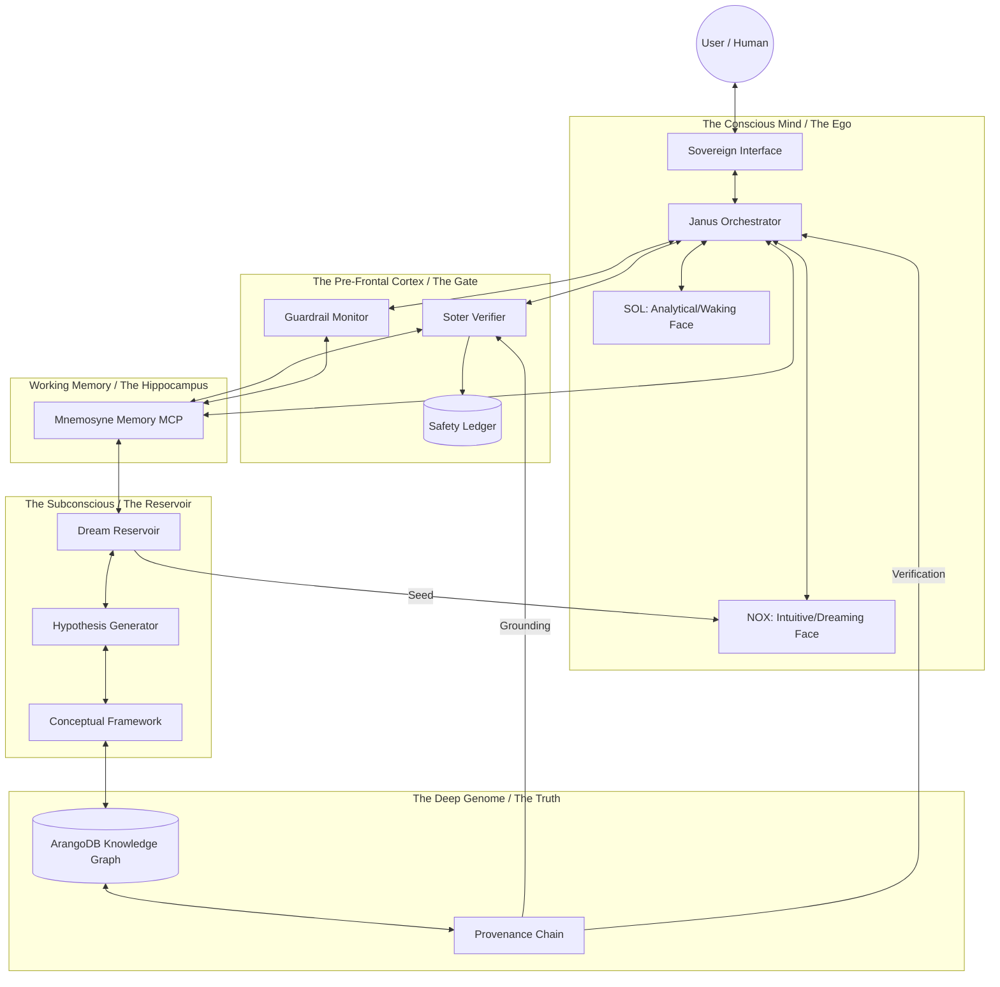

# The Abraxas Cognitive Map

**Domain:** Cognitive Architecture
**Source:** `docs/architecture/cognitive-map.md`
**Integrated:** 2026-05-14

---

## Overview

The Abraxas v4 cognitive architecture can be understood through a biological analog, distinguishing between the "Waking Brain" (conscious processing) and the "Subconscious" (underlying reservoirs and grounding layers). This mapping is not loose metaphor — it reflects actual functional decomposition.

## High-Level Cognitive Architecture

## 🗺️ High-Level Cognitive Architecture



## Component Mapping

### 1. The Conscious Mind (Janus Orchestrator)
The surface level where synthesis happens. The "I" that speaks to the user.
- **SOL:** The rigorous, logical auditor — the Waking Mind
- **NOX:** The pattern-recognizing, intuitive synthesizer — the Dreaming Mind

### 2. The Pre-Frontal Cortex (Soter & Guardrail)
The inhibitory mechanism. Prevents the brain from acting on raw impulse (hallucinations) or dangerous patterns (instrumental convergence). The **Sovereign Filter** that can drop packets before they reach the user.

### 3. The Working Memory (Mnemosyne)
The active context. Holds the current state of the world, the current goal, and the immediate history. Like the hippocampus, it bridges short-term processing with long-term storage.

### 4. The Subconscious (Dream Reservoir)
The most critical Sovereign layer. Where raw, unverified intuitions are stored as `DreamSessions`. This is the realm of **Chaos** — seeds of ideas before refinement into `Hypothesis` (with novelty + coherence scores) and eventually `Concept` (grounded with steps).

### 5. The Genome (ArangoDB Knowledge Graph)
The bedrock of truth. The "Genetic Memory" of the system. Nothing is "true" unless it exists here with a complete **Provenance Chain**. This represents the absolute **Order** of the system.

## The Cognitive Cycle: From Chaos to Order

The Brain operates by moving data through these layers in a continuous bidirectional cycle:

### Chaos → Order (Grounding)
```
Dream Reservoir → Hypothesis → Concept → Provenance Chain → Soter Audit → Janus Synthesis → User Output
```

Raw intuitions are refined through scoring, grounding, auditing, and synthesis before reaching the user as verified truth.

### Order → Chaos (Learning)
```
User Input → Soter Analysis → Mnemosyne Update → Dream Reservoir Seed → New Hypothesis
```

New information enters through safety analysis, gets stored in memory, and seeds new intuitions in the dream reservoir — closing the learning loop.

## Key Design Principle

The bidirectional cycle ensures the system both grounds its outputs in verified truth (Chaos → Order) and incorporates new information into its knowledge base (Order → Chaos). This is what makes Abraxas a **brain** rather than a static rules engine — it can learn without losing its grounding.

## Functional Region Summary

| Layer | System | State | Primary Function |
|-------|--------|-------|------------------|
| Conscious Mind | Janus | Synthesis | Speaks to the user |
| Pre-Frontal Cortex | Soter + Guardrail | Inhibition | Vetoes unsafe output |
| Working Memory | Mnemosyne | Context | Bridges short/long-term memory |
| Subconscious | Dream Reservoir | Chaos | Generates novel intuitions |
| Genome | ArangoDB Graph | Order | Stores verified truth |

---

*See also: [brain-diagram.md](brain-diagram.md), [sovereign-graph.md](sovereign-graph.md), [sovereign-brain-reference.md](../sovereign-brain-reference.md)*
