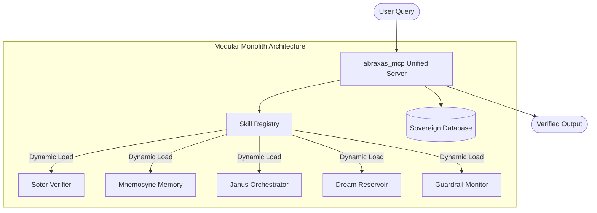

# The Sovereign MCP Architecture Map

**Domain:** Technical Architecture
**Source:** `docs/architecture/mcp-map.md`
**Integrated:** 2026-05-14

---

## Overview

Abraxas v4 consolidates the formerly distributed "5-Pillar" swarm into a **Modular Monolith**: the `abraxas_mcp` server. This server dynamically loads skill modules while providing a unified interface for the LLM, reducing operational complexity and latency while preserving deterministic verification guarantees.

## System Topology

The modular monolith follows this core topology:

## The Unified Core Pillars

| Logical Pillar | Purpose | Primary Function |
|----------------|---------|------------------|
| **Dream Reservoir** | Intent capture, query routing, MCP dispatch | The "Origin" — tracks provenance from dream to actionable plan |
| **Soter Verifier** | Safety checks, risk scoring, instrumental convergence detection | The "Police" — monitors for safety violations and vetoes responses |
| **Mnemosyne Memory** | Context management, session state, recall | The "Librarian" — provides raw, immutable facts from the Sovereign Vault |
| **Janus Orchestrator** | MCP coordination, response synthesis, epistemic labeling | The "Judge" — manages cognitive modes (Sol/Nox) and labels epistemic status |
| **Guardrail Monitor** | Real-time safety, policy enforcement, audit logging | The "Auditor" — maintains an immutable log of all interventions |

## Key Architectural Decisions

### Modular Monolith Over Microservices
The 5-pillar swarm architecture was consolidated into a single server for several reasons:
- Eliminates inter-service latency
- Simplifies the dependency graph
- Enables unified error handling and health monitoring
- Reduces Docker/Dolt operational complexity
- Preserves logical separation through module loading

### Dynamic Skill Loading
Skills are loaded at runtime through a registry pattern, allowing:
- Hot-swappable skill modules
- Graceful degradation when services are unavailable
- Constitution drift detection (comparing loaded skills against genesis.md)
- Easy addition of new skills without server restarts

### Unified Shelling
The modular monolith wraps all probabilistic processing in a deterministic shell:
- Input verification (Soter) happens before any LLM interaction
- Output verification (Guardrail) happens before any user delivery
- The LLM never directly handles raw input or delivers raw output

---

*See also: [janus-orchestration.md](janus-orchestration.md), [sovereign-brain-reference.md](../sovereign-brain-reference.md)*
