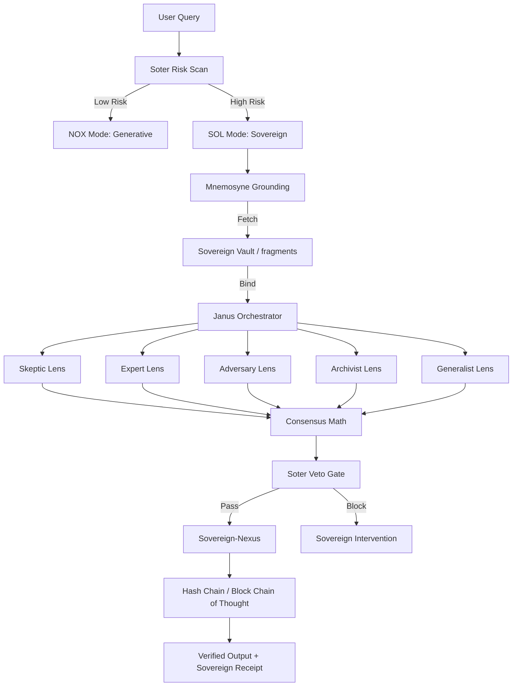

# The Sovereign Graph: ArangoDB Provenance Schema

**Domain:** Data Layer
**Source:** `docs/architecture/sovereign-graph.md`
**Integrated:** 2026-05-14

---

## Overview

The Abraxas Brain does not use standard RAG; it uses a **Provenance Graph**. This turns memory from a "hint" into a **Required Foundation**. The system maintains a high-fidelity map of truths, logic, and events in an ArangoDB v4.2-compatible graph database — the **Dream Reservoir**.

## Graph Architecture

### Vertex Collections (Nodes)

| Collection | Description | Key Attributes |
|------------|-------------|----------------|
| `fragments` | Atomic units of verified truth | `content`, `provenance_id`, `trust_weight`, `verified` |
| `claims` | Conclusions derived from fragments | `conclusion`, `consensus_ratio`, `timestamp` |
| `events` | The Block Chain of Thought | `index`, `previous_hash`, `current_hash`, `content` |

### Edge Collections (Relationships)

| Edge Type | From → To | Meaning |
|-----------|-----------|---------|
| `DERIVED_FROM` | `claim` → `fragment` | Architectural link proving a claim is grounded |
| `NEXT_STEP` | `event` → `event` | Temporal sequence of the reasoning chain |
| `SUPERSEDES` | `fragment` → `fragment` | Epistemic versioning (Old Truth → New Truth) |

## The Block Chain of Thought

The `events` collection implements a hash-chain structure where each event records its `previous_hash` and computes its `current_hash`, creating an immutable audit trail of reasoning steps. This enables forensic reconstruction of any decision path.

## The Sovereign Receipt

When the system returns a `[Sovereign Consensus: X/M]` seal, it provides a pointer to a path in this graph. An auditor can traverse the `events` chain back to the `fragments` to verify the actual evidence used.

**The receipt contains:**
- Entity ID referencing the claim node
- Consensus ratio (N-of-M agreement)
- Timestamp and session ID
- Hash chain pointer to the full reasoning path

## Cognitive Flow

The complete cognitive flow from user query through verification to sovereign output:



## Provenance Graph Schema

The graph uses an entity-first model:

```graphql
type Hypothesis {
  hypothesisId: ID!
  sessionId: ID!
  rawPatternRepresentation: String!
  noveltyScore: Float!    # 0-1
  coherenceScore: Float!  # 0-1
  creativeDrivers: [CreativeDriver!]!
  channelId: String!      # Sovereign channel
  timestamp: DateTime!
  provenanceChain: [ProvenanceNode!]!
}

type ProvenanceNode {
  entityId: ID!
  entityType: 'CONCEPT' | 'HYPOTHESIS' | 'PLAN' | 'SESSION'
  relationship: String!
  timestamp: DateTime!
  channelId: String!
}
```

## Key Insight

The Provenance Graph provides what RAG cannot: a **deterministic**, **queryable**, and **immutable** path from any claim back to its evidence fragments. Truth is not found by searching similar text — it is found by traversing verified edges in a graph.

---

*See also: [sovereign-security.md](sovereign-security.md), [brain-diagram.md](brain-diagram.md), [sovereign-brain-reference.md](../sovereign-brain-reference.md)*
